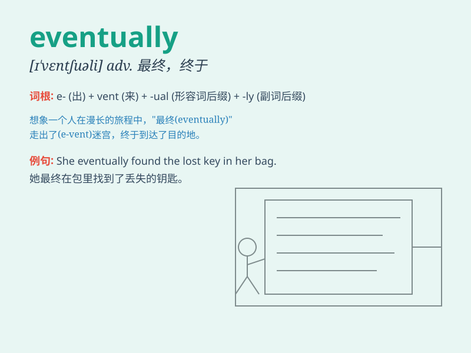

## eventually

**英音:** _[ɪ\'ventʃʊəlɪ]_ **美音:** _[ɪ\'vɛntʃuəli]_

**译义:** *adv.最后,终于*

### 短语

+ **eventually come true:** _最终实现_

+ **eventually succeed:** _最终成功_

+ **eventually find out:** _最终发现_

+ **eventually give up:** _最终放弃_

+ **eventually understand:** _最终理解_

### 例句

#### 例句1

> **He worked hard and eventually achieved his goal.**

**中文翻译:** 他努力工作，最终实现了他的目标。

**单词释义:** 最终；最后

#### 例句2

> **The rain eventually stopped and the sun came out.**

**中文翻译:** 雨最终停了，太阳出来了。

**单词释义:** 最终

#### 例句3

> **She eventually found the key she had been looking for.**

**中文翻译:** 她最终找到了她一直在寻找的钥匙。

**单词释义:** 最终

### 背诵小故事

> Once upon a time, a little ant was constantly climbing a tall
mountain. It faced many difficulties but never gave up. Eventually, it
reached the top and saw the beautiful view. Eventually means in the end,
after a long time or series of events.

**从前，一只小蚂蚁一直在爬一座高山。它面临许多困难但从未放弃。最终，它到达了山顶并看到了美丽的景色。eventually
意思是最终，经过很长时间或一系列事件之后。**

### 图义

