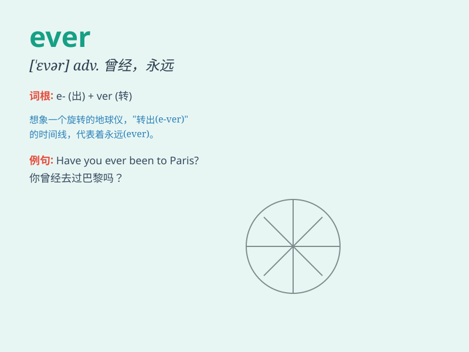

## ever

**英音:** _[\'evə]_ **美音:** _[\'ɛvɚ]_

**译义:** *adv.曾经,永远,不断地,在任何时候,究竟*

### 短语

+ **ever since:** _自从；自......以后_

+ **ever so:** _非常；极其_

+ **for ever:** _永远；老是_

+ **hardly ever:** _几乎从不；很少_

+ **ever more:** _永远；始终；越来越_

### 例句

#### 例句1

> **Have you ever been to Paris?**

**中文翻译:** 你曾经去过巴黎吗？

**单词释义:** 曾经

#### 例句2

> **I don\'t think I\'ll ever understand this.**

**中文翻译:** 我觉得我永远都不会理解这个。

**单词释义:** 永远

#### 例句3

> **If you ever need help, just call me.**

**中文翻译:** 如果你有任何需要帮助的时候，就给我打电话。

**单词释义:** 任何时候

### 背诵小故事

> A brave knight was on a long journey. No matter how hard the road
was, he asked himself \'Ever will I give up?\' The answer was always
\'Never!\' Meaning he would always keep going.

**一位勇敢的骑士踏上漫长旅程。无论道路多么艰难，他都问自己'我曾经会放弃吗？'答案总是'从不！'这意味着他永远会坚持下去。**

### 图义

