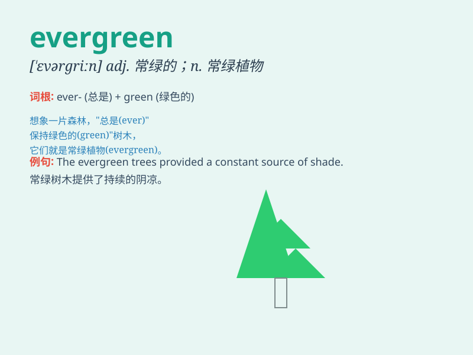

## evergreen

**英音:** _[\'evəgriːn]_ **美音:** _[\'ɛvɚɡrin]_

**译义:** *adj.常绿的n.常绿树,常绿植物*

### 短语

+ **evergreen tree:** _常绿树_

+ **evergreen plant:** _常绿植物_

+ **evergreen forest:** _常绿林_

+ **evergreen shrub:** _常绿灌木_

+ **evergreen vine:** _常绿藤本植物_

### 例句

#### 例句1

> **The pine is an evergreen tree.**

**中文翻译:** 松树是一种常青树。

**单词释义:** 常青的

#### 例句2

> **She wore an evergreen dress to the party.**

**中文翻译:** 她穿着一件常青色的连衣裙去参加聚会。

**单词释义:** 常青色的

#### 例句3

> **His career has been evergreen, with continuous success.**

**中文翻译:** 他的事业一直长盛不衰，不断取得成功。

**单词释义:** 长盛不衰的

### 背诵小故事

> 在一个神秘的森林里，有一棵特别的树，它四季常绿，从不凋零。人们称它为
evergreen。无论春夏秋冬，它始终保持着生机与活力，就像永恒的绿色希望。

**在一个神秘森林里，有一棵四季常绿从不凋零的特别的树被称为常青树。无论季节如何，它都像永恒的绿色希望。**

### 图义

