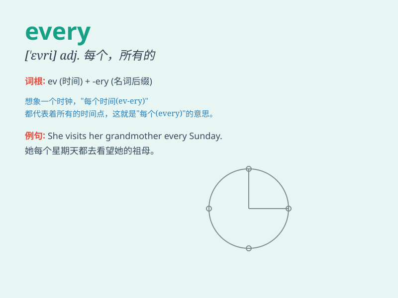

## every

**英音:** _[\'evrɪ]_ **美音:** _[\'ɛvri]_

**译义:** *adj.每一的,每个的,全部的,每隔\...的*

### 短语

+ **every day:** _每天_

+ **every time:** _每次_

+ **every one:** _每个人；人人_

+ **every other:** _每隔一个_

+ **every now and then:** _不时；偶尔；有时_

### 例句

#### 例句1

> **Every student in the class passed the exam.**

**中文翻译:** 班上的每一个学生都通过了考试。

**单词释义:** 每一个

#### 例句2

> **I go jogging every morning.**

**中文翻译:** 我每天早上都去慢跑。

**单词释义:** 每一

#### 例句3

> **She visits her parents every weekend.**

**中文翻译:** 她每个周末都去看望她的父母。

**单词释义:** 每个

### 背诵小故事

> There was a magic box that could grant a wish every time you opened
it. One day, a little girl opened it and got her favorite toy. \'Every\'
means all, each, and any time.

**有一个神奇的盒子，每次你打开它，它都能实现一个愿望。有一天，一个小女孩打开它并得到了她最喜欢的玩具。\'every\'意思是所有的、每个、任何时候。**

### 图义

