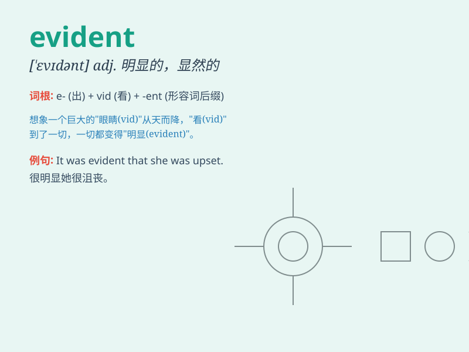

## evident

**英音:** _[\'evɪd(ə)nt]_ **美音:** _[\'ɛvɪdənt]_

**译义:** *adj.明显的,显然的*

### 短语

+ **be evident:** _是显而易见的_

+ **become evident:** _变得明显_

+ **make evident:** _使明显；表明_

+ **quite evident:** _相当明显_

+ **self-evident:** _不言而喻的；不证自明的_

### 例句

#### 例句1

> **It is evident that she is very talented.**

**中文翻译:** 很明显，她非常有才华。

**单词释义:** 明显的

#### 例句2

> **The damage caused by the storm was evident everywhere.**

**中文翻译:** 风暴造成的破坏随处可见，这是显而易见的。

**单词释义:** 显而易见的

#### 例句3

> **His evident anger made everyone silent.**

**中文翻译:** 他明显的愤怒让大家都沉默了。

**单词释义:** 明显的

### 背诵小故事

> One day, a thief broke into a house. The broken window and scattered
items were evident signs of the burglary. The police easily understood
what had happened based on these evident clues.

**一天，一个小偷闯入了一所房子。破碎的窗户和散落的物品是入室盗窃的明显迹象。警察根据这些明显的线索很容易就明白了发生了什么。**

### 图义

