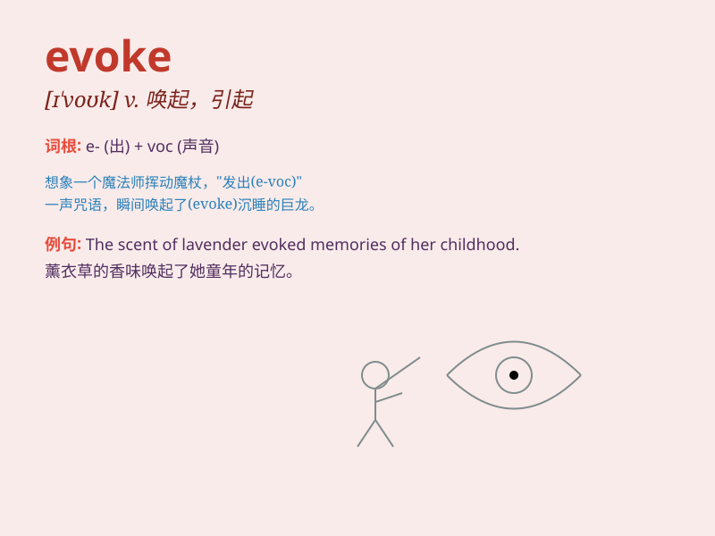

## evoke

**英音:** _[ɪ\'vəʊk]_ **美音:** _[ɪ\'vok]_

**译义:** *vt.唤起,引起,博得*

### 短语

+ **evoke memories:** _唤起回忆_

+ **evoke emotions:** _唤起情感_

+ **evoke a response:** _引起反应_

+ **evoke images:** _唤起形象_

+ **evoke admiration:** _引起钦佩_

### 例句

#### 例句1

> **The old photo evoked memories of my childhood.**

**中文翻译:** 这张老照片唤起了我童年的回忆。

**单词释义:** 唤起；引起

#### 例句2

> **Her smile evoked a warm response from the audience.**

**中文翻译:** 她的微笑引起了观众热烈的回应。

**单词释义:** 引起；激起

#### 例句3

> **The music evoked a feeling of peace and tranquility.**

**中文翻译:** 这段音乐唤起了一种平和宁静的感觉。

**单词释义:** 唤起；引发

### 背诵小故事

> A painter\'s masterpiece evoked strong emotions in the viewers. The
beautiful colors and unique style brought back memories of their
childhood. Just like this, \'evoke\' means to bring out or call forth
something, like feelings or memories.

**一位画家的杰作唤起了观众强烈的情感。美丽的色彩和独特的风格勾起了他们童年的回忆。就像这样，'evoke'意思是引出或唤起某物，比如情感或记忆。**

### 图义

