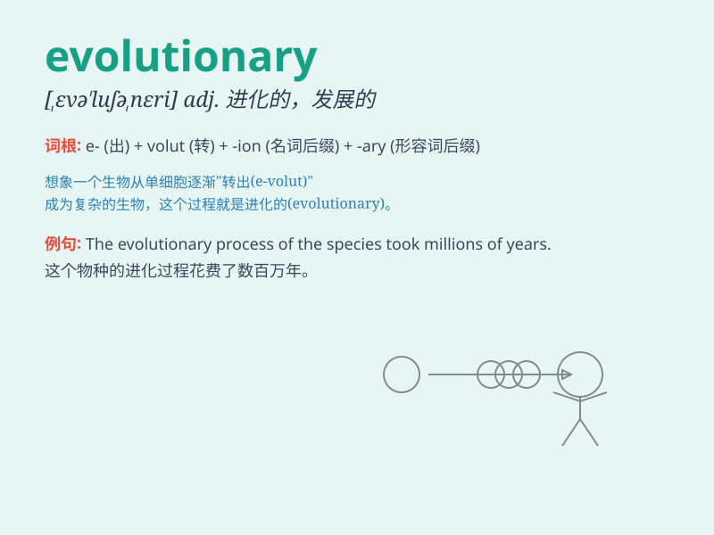

## evolutionary

**英音:** _[ˌevə\'luːʃənərɪ]_ **美音:**
_[ˌɛvə\'luʃənɛrɪ]_

**译义:** * 进化的*

### 短语

+ **evolutionary process:** _进化过程_

+ **evolutionary theory:** _进化论_

+ **evolutionary change:** _进化变化_

+ **evolutionary history:** _进化史_

+ **evolutionary adaptation:** _进化适应_

### 例句

#### 例句1

> **Evolutionary processes have shaped the diversity of life on
Earth.**

**中文翻译:** 进化过程塑造了地球上生命的多样性。

**单词释义:** 进化的

#### 例句2

> **The theory of evolutionary biology explains how species change
over time.**

**中文翻译:** 进化生物学理论解释了物种是如何随时间变化的。

**单词释义:** 进化的

#### 例句3

> **Evolutionary psychology studies the roots of human behavior.**

**中文翻译:** 进化心理学研究人类行为的根源。

**单词释义:** 进化的

### 背诵小故事

> A monkey was evolving gradually. It learned new skills and changed
its behaviors, showing an evolutionary process. This process made it
better adapt to the environment. Remember, \'evolutionary\' means
related to evolution.

**一只猴子在逐渐进化。它学会了新技能，改变了行为，展现出一个进化的过程。这个过程使它能更好地适应环境。记住，\'evolutionary\'意思是与进化有关的。**

### 图义

