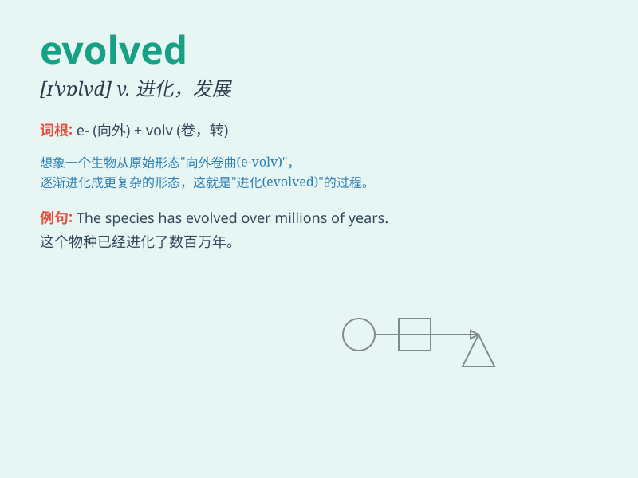

## evolved

**英音:** _[ɪˈvɒlvd]_ **美音:** _[ɪˈvɑːlvd]_

**译义:** *v. 进化；逐步发展（evolve 的过去式和过去分词）*

### 短语

+ **evolved from:** _从\...进化而来_

+ **have evolved:** _已经进化_

+ **evolved form:** _进化形式_

+ **gradually evolved:** _逐渐进化_

+ **rapidly evolved:** _快速进化_

### 例句

#### 例句1

> **The company has evolved into a global leader in technology.**

**中文翻译:** 这家公司已发展成为全球技术领域的领导者。

**单词释义:** 发展；进化

#### 例句2

> **Language has evolved over time.**

**中文翻译:** 语言随着时间的推移而演变。

**单词释义:** 演变；进化

#### 例句3

> **The species evolved to adapt to the changing environment.**

**中文翻译:** 这个物种进化以适应不断变化的环境。

**单词释义:** 进化；逐渐形成

### 背诵小故事

> Long ago, a simple creature started a journey. Through many
challenges and changes, it gradually grew and changed. Eventually, it
evolved into a complex and wonderful being. This is how evolution
works - like the word \'evolved\'.

**很久以前，一个简单的生物开始了一段旅程。历经许多挑战和变化，它逐渐成长和改变。最终，它进化成了一个复杂而奇妙的存在。这就是进化的过程------就像单词'evolved'所表达的那样。**

### 图义

