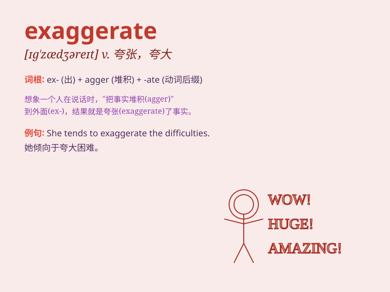

## exaggerate

**英音:** _[ɪg\'zædʒəreɪt; eg-]_ **美音:**
_[ɪɡ\'zædʒəret]_

**译义:** *v.夸大,夸张*

### 短语

+ **exaggerate the difficulty:** _夸大困难_

+ **exaggerate the importance:** _夸大重要性_

+ **exaggerate one\'s achievements:** _夸大某人的成就_

+ **exaggerate the story:** _夸张故事_

+ **exaggerate the effect:** _夸大效果_

### 例句

#### 例句1

> **He always exaggerates his achievements.**

**中文翻译:** 他总是夸大自己的成就。

**单词释义:** 夸大

#### 例句2

> **Don\'t exaggerate the difficulty of the task.**

**中文翻译:** 不要夸大任务的难度。

**单词释义:** 夸大

#### 例句3

> **She tends to exaggerate her problems.**

**中文翻译:** 她倾向于夸大自己的问题。

**单词释义:** 夸大

### 背诵小故事

> A boy always exaggerated his achievements when telling stories to his
friends. One day, he said he caught a fish as big as a car. But his
friends didn\'t believe him. They knew he was exaggerating.

**一个男孩在给朋友们讲故事时总是夸大他的成就。有一天，他说他抓到了一条和汽车一样大的鱼。但他的朋友们不相信他。他们知道他在夸张。**

### 图义

