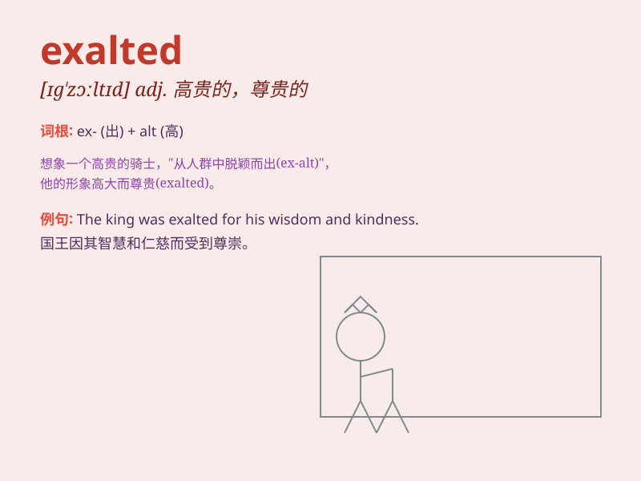

## exalted

**英音:** _[ɪg\'zɔːltɪd]_ **美音:** _[ɪg\'zɔltɪd]_

**译义:** *adj.尊贵的,高位的,兴奋的,高尚的*

### 短语

+ **exalted position:** _高位；尊贵的地位_

+ **exalted ideal:** _崇高的理想_

+ **exalted state:** _崇高的境界_

+ **exalted mood:** _兴奋的心情_

+ **exalted reputation:** _崇高的声誉_

### 例句

#### 例句1

> **He was exalted to the position of CEO.**

**中文翻译:** 他被提升到首席执行官的位置。

**单词释义:** 提升；提拔

#### 例句2

> **The poet sang in exalted tones about the beauty of nature.**

**中文翻译:** 诗人用崇高的语调歌颂了大自然的美丽。

**单词释义:** 激昂的；兴奋的

#### 例句3

> **She felt exalted at the thought of helping those in need.**

**中文翻译:** 一想到能够帮助那些需要帮助的人，她就感到很高兴。

**单词释义:** 心情振奋的；兴高采烈的

### 背诵小故事

> A young artist\'s painting was chosen for a famous exhibition. People
praised his work highly and he felt exalted. It was a moment of great
honor and pride for him.

**一位年轻艺术家的画作被选入一个著名的展览。人们对他的作品高度赞扬，他感到备受尊崇。这对他来说是一个充满荣耀和自豪的时刻。**

### 图义

