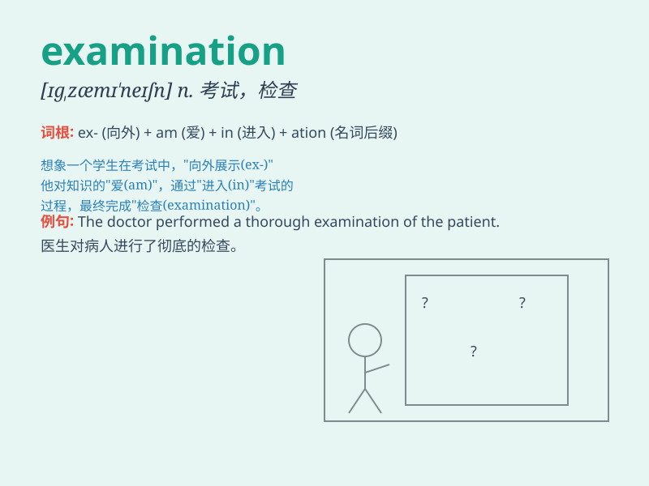

## examination

**英音:** _[ɪg,zæmɪ\'neɪʃ(ə)n; eg-]_ **美音:**
_[ɪg\'zæmə\'neʃən]_

**译义:** *n.考试,检查,细查*

### 短语

+ **final examination:** _期末考试_

+ **entrance examination:** _入学考试_

+ **medical examination:** _体格检查_

+ **examination paper:** _试卷_

+ **pass an examination:** _通过考试_

### 例句

#### 例句1

> **I have an examination in mathematics tomorrow.**

**中文翻译:** 我明天有数学考试。

**单词释义:** 考试

#### 例句2

> **The doctor gave her a thorough examination.**

**中文翻译:** 医生给她做了全面的检查。

**单词释义:** 检查

#### 例句3

> **The results of the examination will be announced next week.**

**中文翻译:** 考试结果将于下周公布。

**单词释义:** 考试

### 背诵小故事

> 小明为了即将到来的 examination
拼命复习。考试那天，他紧张地走进教室，面对一道道难题，努力回想所学知识。最终，他成功通过了这次重要的
examination。

**小明为了即将到来的考试拼命复习。考试那天，他紧张地走进教室，面对一道道难题，努力回想所学知识。最终，他成功通过了这次重要的考试。**

### 图义

