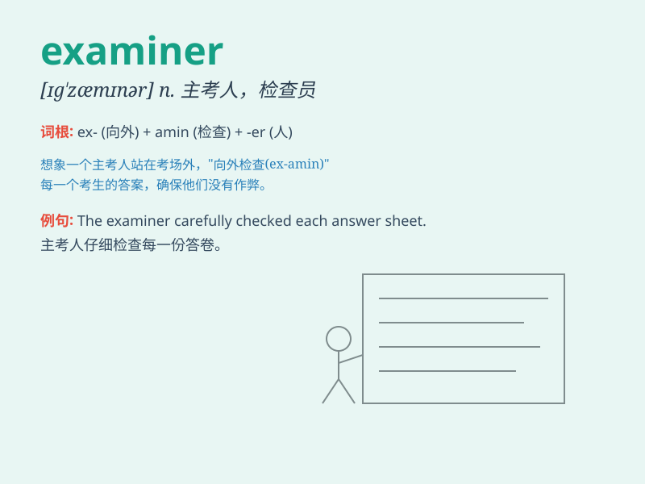

## examiner

**英音:** _[ɪg\'zæmɪnə]_ **美音:** _[ɪg\'zæmɪnɚ]_

**译义:** *n.主考者*

### 短语

+ **chief examiner:** _主考人_

+ **medical examiner:** _法医_

+ **examiner\'s report:** _主考人的报告_

+ **qualifications examiner:** _资格审查员_

+ **language examiner:** _语言考官_

### 例句

#### 例句1

> **The examiner was very strict during the test.**

**中文翻译:** 考试时考官非常严格。

**单词释义:** 主考人；审查员

#### 例句2

> **The medical examiner determined the cause of death.**

**中文翻译:** 法医确定了死因。

**单词释义:** 检验员；审查员

#### 例句3

> **The examiner carefully reviewed the student\'s work.**

**中文翻译:** 考官仔细审阅了学生的作业。

**单词释义:** 审查员

### 背诵小故事

> A brave student was very nervous before meeting the examiner. But
when he saw the examiner\'s friendly smile, he felt at ease. The
examiner was fair and patient, making the exam a pleasant experience.

**一个勇敢的学生在见主考人之前非常紧张。但当他看到主考人友好的微笑时，他感到轻松了。主考人公平且有耐心，使考试成为一次愉快的经历。**

### 图义

