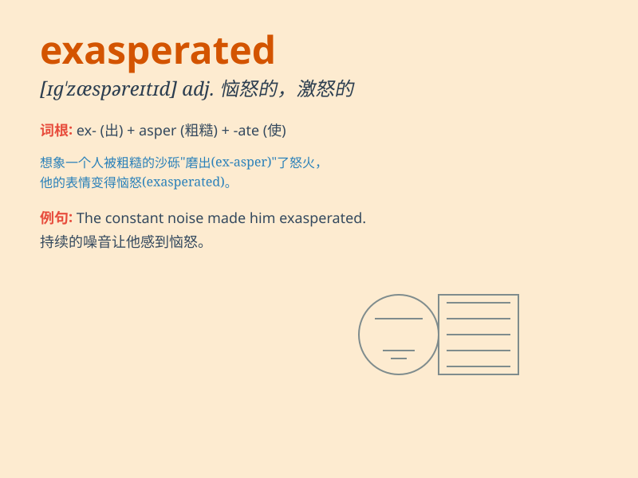

## exasperated

**英音:** _[ɪɡˈzæspəreɪtɪd]_ **美音:**
_[ɪɡˈzæspəreɪtɪd]_

**译义:** *adj.恼怒的；烦恼的；愤怒的；恼火的*

### 短语

+ **be exasperated at:** _对\...\...感到恼怒_

+ **exasperated expression:** _恼怒的表情_

+ **exasperated tone:** _恼怒的语气_

+ **feel exasperated:** _感到恼怒_

+ **exasperated shout:** _恼怒的呼喊_

### 例句

#### 例句1

> **I was exasperated by his constant complaining.**

**中文翻译:** 我被他不停地抱怨弄得恼怒不已。

**单词释义:** 恼怒的；愤怒的

#### 例句2

> **She looked exasperated when she heard the news.**

**中文翻译:** 当她听到这个消息时，她看起来很恼怒。

**单词释义:** 恼怒的；生气的

#### 例句3

> **His exasperated tone showed how frustrated he was.**

**中文翻译:** 他恼怒的语气显示出他是多么沮丧。

**单词释义:** 恼怒的；恼火的

### 背诵小故事

> A man was constantly facing difficult tasks at work. No matter how
hard he tried, problems kept coming. Finally, he became exasperated,
meaning he was extremely frustrated and annoyed.

**一个男人在工作中不断面临困难的任务。无论他多么努力，问题不断出现。最后，他变得恼怒至极，exasperated
意思就是极其恼怒和沮丧。**

### 图义

