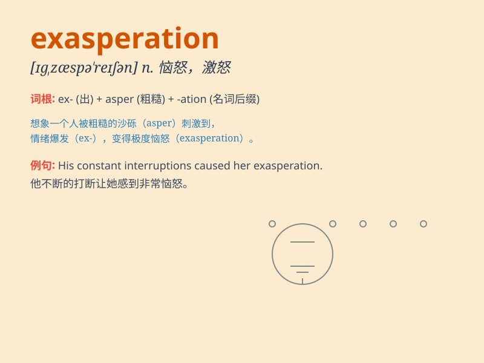

## exasperation

**英音:** _[ɪg,zæspə\'reɪʃ(ə)n]_ **美音:**
_[ɪg,zæspə\'reʃ(ə)n]_

**译义:** *n.恼怒*

### 短语

+ **in exasperation:** _愤怒地；恼怒地_

+ **express exasperation:** _表示恼怒_

+ **feel exasperation:** _感到恼怒_

+ **show exasperation:** _表现出恼怒_

+ **reduce exasperation:** _减轻恼怒_

### 例句

#### 例句1

> **His constant lateness drove her to exasperation.**

**中文翻译:** 他总是迟到，这让她很恼火。

**单词释义:** 恼怒；激怒

#### 例句2

> **She threw up her hands in exasperation.**

**中文翻译:** 她愤怒地举起双手。

**单词释义:** 恼怒；激怒

#### 例句3

> **The exasperation in his voice was obvious.**

**中文翻译:** 他声音中的愤怒显而易见。

**单词释义:** 恼怒；激怒

### 背诵小故事

> One day, Tom was constantly facing problems at work. The endless
delays and mistakes made him feel extremely frustrated. This feeling of
extreme frustration was his exasperation.

**有一天，汤姆在工作中不断地遇到问题。没完没了的延误和错误让他感到极度沮丧。这种极度沮丧的感觉就是他的恼怒。**

### 图义

