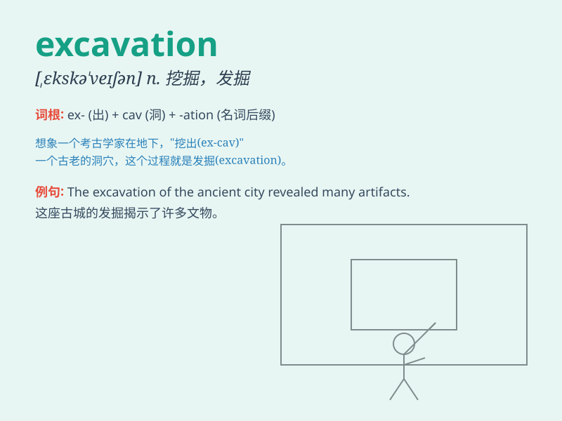

## excavation

**英音:** _[ekskə\'veɪʃ(ə)n]_ **美音:**
_[,ɛkskə\'veʃən]_

**译义:** *n.挖掘,发掘,挖掘成的洞,出土文物*

### 短语

+ **archaeological excavation:** _考古发掘_

+ **excavation site:** _挖掘现场_

+ **mine excavation:** _矿山开采_

+ **underground excavation:** _地下挖掘_

+ **excavation work:** _挖掘工作_

### 例句

#### 例句1

> **The excavation of the ancient tomb revealed many valuable
artifacts.**

**中文翻译:** 古墓的发掘出土了许多珍贵的文物。

**单词释义:** 挖掘；发掘

#### 例句2

> **The archaeologists are carefully planning the excavation of the
site.**

**中文翻译:** 考古学家正在仔细计划该遗址的发掘工作。

**单词释义:** 挖掘；发掘

#### 例句3

> **The excavation work caused some disruption to the local
traffic.**

**中文翻译:** 挖掘工作对当地交通造成了一定程度的干扰。

**单词释义:** 挖掘（工作）

### 背诵小故事

> A team of archaeologists was on an excavation mission. They dug deep
into the ground, looking for ancient treasures. The process of digging
and uncovering was called excavation.

**一组考古学家正在执行挖掘任务。他们在地下深挖，寻找古代的宝藏。这种挖掘和揭开的过程就叫做
excavation。**

### 图义

