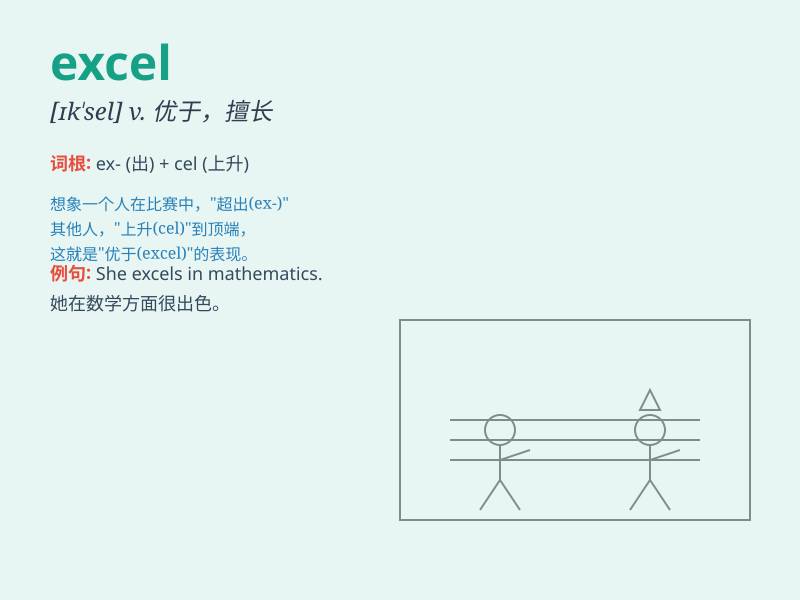

## excel

**英音:** _[ɪk\'sel; ek-]_ **美音:** _[ɪk\'sɛl]_

**译义:** *v.优秀,胜过他人*

### 短语

+ **excel in:** _在......方面擅长；突出_

+ **excel oneself:** _超越自我；表现出色_

+ **excel at:** _擅长于；突出于_

+ **excel through:** _通过......表现出色_

+ **excel beyond:** _超越；优于_

### 例句

#### 例句1

> **She excels in mathematics.**

**中文翻译:** 她在数学方面表现出色。

**单词释义:** 擅长；突出

#### 例句2

> **This athlete excels at long-distance running.**

**中文翻译:** 这位运动员擅长长跑。

**单词释义:** 擅长；胜过

#### 例句3

> **His work always excels that of his colleagues.**

**中文翻译:** 他的工作总是优于他的同事。

**单词释义:** 优于；超过

### 背诵小故事

> 小明在学校的各项比赛中总是努力
excel，他不仅学习成绩优异，体育也很出色。每次竞赛他都超越自我，最终
excel 成为全校的明星学生。

**小明在学校的各项比赛中总是努力表现出色，他不仅学习成绩优异，体育也很出色。每次竞赛他都超越自我，最终成为全校的杰出学生。**

### 图义

