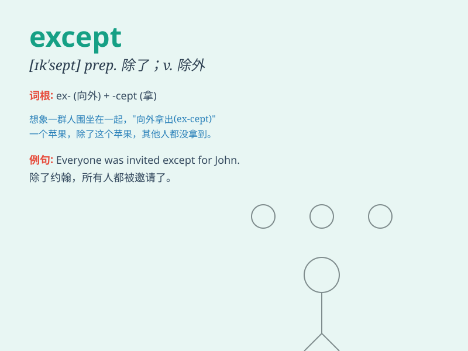

## except

**英音:** _[ɪkˈsept]_ **美音:** _[ɪk\'sɛpt]_

**译义:** *vt.除,把\...除外,反对,不计vi.反对
prep.除了\...之外,若不是,除非 conj.只是,要不是*

### 短语

+ **except for:** _除了...以外；要不是由于_

+ **except when:** _除了当...的时候_

+ **except that:** _除了...之外；只是_

+ **with the exception of:** _除...之外_

+ **no exception:** _没有例外_

### 例句

#### 例句1

> **Everyone was there except John.**

**中文翻译:** 除了约翰之外，每个人都在那里。

**单词释义:** 除\...\...之外

#### 例句2

> **I like all fruits except bananas.**

**中文翻译:** 我喜欢除了香蕉以外的所有水果。

**单词释义:** 除\...\...之外

#### 例句3

> **He does nothing except watch TV all day.**

**中文翻译:** 他整天除了看电视什么都不做。

**单词释义:** 除\...\...之外

### 背诵小故事

> One day, all the students in the class went on a trip except Tom.
Because he was sick. So \'except\' means leaving out or excluding
someone or something.

**一天，班上所有的学生都去旅行了，除了汤姆。因为他生病了。所以'except'意思是把某人或某物排除在外。**

### 图义

