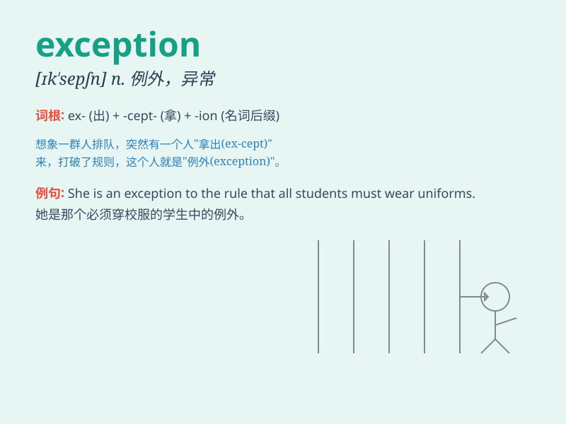

## exception

**英音:** _[ɪk\'sepʃ(ə)n; ek-]_ **美音:** _[ɪk\'sɛpʃən]_

**译义:** *n.除外,例外,反对,异议*

### 短语

+ **make an exception:** _破例；作为例外_

+ **without exception:** _毫无例外地；一律_

+ **take exception to:** _反对；对\...\...表示异议_

+ **exception clause:** _例外条款_

+ **exception handling:** _异常处理；例外处理_

### 例句

#### 例句1

> **There is an exception to every rule.**

**中文翻译:** 每条规则都有一个例外。

**单词释义:** 例外；除外

#### 例句2

> **She was granted an exception from the dress code.**

**中文翻译:** 她获得了着装规定的例外。

**单词释义:** 破例；特许

#### 例句3

> **This is the only exception to the general trend.**

**中文翻译:** 这是总体趋势的唯一例外。

**单词释义:** 例外

### 背诵小故事

> A brave knight was always following the rules of the kingdom. But one
day, he broke a rule to save a child. This was an exception because his
motive was pure. The king forgave him.

**一位勇敢的骑士一直遵守王国的规则。但有一天，他为了救一个孩子违反了一条规则。这是个例外，因为他的动机是纯粹的。国王原谅了他。**

### 图义

