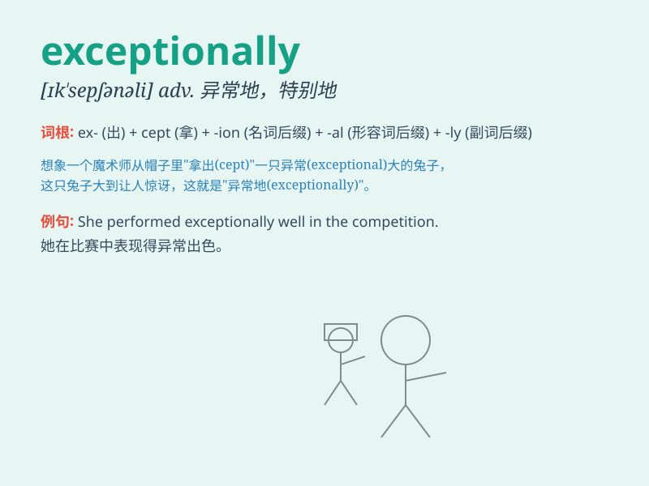

## exceptionally

**英音:** _[ɪkˈsepʃən.ə.lɪ]_ **美音:**
_[ɪkˈsepʃən.ə.li]_

**译义:** *副词，意为\'异常地；特别地；格外；罕见地\'*

### 短语

+ **exceptionally good:** _特别好_

+ **exceptionally talented:** _极具天赋_

+ **exceptionally difficult:** _异常困难_

+ **exceptionally beautiful:** _美得出奇_

+ **exceptionally brave:** _格外勇敢_

### 例句

#### 例句1

> **The weather was exceptionally fine today.**

**中文翻译:** 今天的天气格外好。

**单词释义:** 格外；特别

#### 例句2

> **She performed exceptionally well in the exam.**

**中文翻译:** 她在考试中表现得特别出色。

**单词释义:** 特别；极其

#### 例句3

> **This dress is exceptionally beautiful.**

**中文翻译:** 这件连衣裙特别漂亮。

**单词释义:** 特别；异常

### 背诵小故事

> Once upon a time, a small town had exceptionally bad weather.
Everyone was worried, but one brave man found a solution.
\'Exceptionally\' here means extremely or unusually.

**从前，有个小镇遭遇了异常恶劣的天气。大家都很担心，但有一个勇敢的人找到了办法。这里的'exceptionally'意思是极其，特别地。**

### 图义

