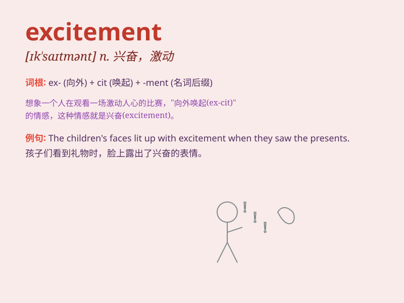

## excitement

**英音:** _[ɪk\'saɪtmənt]_ **美音:** _[ɪk\'saɪtmənt]_

**译义:** *n.刺激,兴奋,激动,搔动*

### 短语

+ **in excitement:** _兴奋地_

+ **with excitement:** _带着兴奋_

+ **feel excitement:** _感到兴奋_

+ **height of excitement:** _极度兴奋_

+ **cause excitement:** _引起兴奋_

### 例句

#### 例句1

> **The news caused great excitement among the fans.**

**中文翻译:** 这一消息引起了球迷的极大兴奋。

**单词释义:** 兴奋；激动

#### 例句2

> **She could feel the excitement building as the concert
approached.**

**中文翻译:** 随着音乐会的临近，她能感觉到人们越来越兴奋。

**单词释义:** 兴奋；激动

#### 例句3

> **The children\'s faces were filled with excitement on Christmas
morning.**

**中文翻译:** 圣诞节的早晨，孩子们的脸上写满了兴奋。

**单词释义:** 兴奋；激动

### 背诵小故事

> One day, I went to an amusement park. The rides, the music, and the
people\'s laughter filled the air. I felt a rush of excitement. It was
like a magic that made my heart race and my face light up with joy.

**有一天，我去了一个游乐园。游乐设施、音乐和人们的笑声弥漫在空中。我感到一阵兴奋。这就像一种魔力，让我的心跳加速，脸上洋溢着喜悦。**

### 图义

