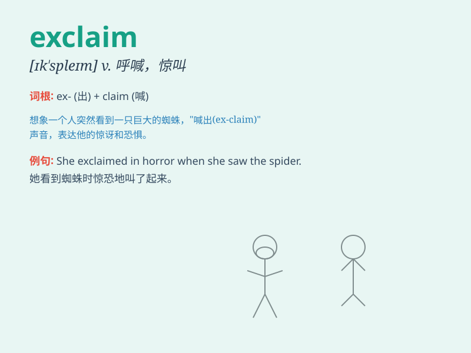

## exclaim

**英音:** _[ɪk\'skleɪm; ek-]_ **美音:** _[ɪk\'sklem]_

**译义:** *v.呼喊,惊叫,大声叫*

### 短语

+ **exclaim in surprise:** _惊讶地呼喊_

+ **exclaim excitedly:** _兴奋地呼喊_

+ **exclaim with delight:** _高兴地呼喊_

+ **exclaim in pain:** _痛苦地呼喊_

+ **exclaim in anger:** _愤怒地呼喊_

### 例句

#### 例句1

> **She exclaimed in delight when she saw the surprise party.**

**中文翻译:** 当她看到这个惊喜聚会时，高兴地惊呼起来。

**单词释义:** 大声呼喊；惊叫

#### 例句2

> **He exclaimed angrily, \'This is not fair!\'**

**中文翻译:** 他愤怒地喊道："这不公平！"

**单词释义:** 呼喊；大声叫嚷

#### 例句3

> **The crowd exclaimed with excitement as the team scored the
winning goal.**

**中文翻译:** 当球队攻入致胜一球时，全场观众兴奋地欢呼起来。

**单词释义:** 呼喊；大声叫

### 背诵小故事

> One day, when Tom saw a big snake in the garden, he was so shocked
that he couldn\'t help exclaiming loudly. His shout scared the snake
away.

**一天，当汤姆在花园里看到一条大蛇时，他非常震惊，忍不住大声惊叫起来。他的呼喊把蛇吓跑了。**

### 图义

