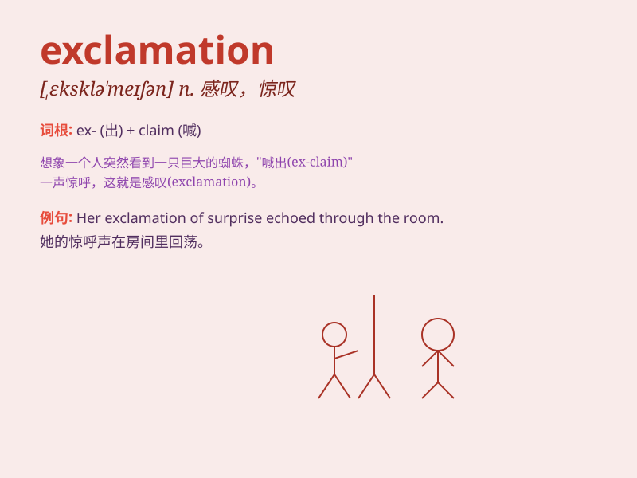

## exclamation

**英音:** _[,eksklə\'meɪʃ(ə)n]_ **美音:**
_[ˌɛkskləˈmeʃən]_

**译义:** *n.惊呼,感叹惊叹,惊叹词*

### 短语

+ **exclamation mark:** _感叹号_

+ **exclamation point:** _感叹号_

+ **sudden exclamation:** _突然的惊叫_

+ **loud exclamation:** _大声的呼喊_

+ **angry exclamation:** _愤怒的呼喊_

### 例句

#### 例句1

> **Her exclamation of surprise caught everyone\'s attention.**

**中文翻译:** 她的一声惊呼，引起了所有人的注意。

**单词释义:** 呼喊；惊叫

#### 例句2

> **An exclamation of delight escaped his lips when he saw the
gift.**

**中文翻译:** 当他看到这份礼物时，嘴里发出一声喜悦的惊叹。

**单词释义:** 感叹；欢呼

#### 例句3

> **The exclamation on her face showed her shock.**

**中文翻译:** 她脸上的惊呼显示出她的震惊。

**单词释义:** 表情；神色

### 背诵小故事

> One day, when Tom was walking in the forest, he suddenly saw a big
snake. He shouted in fear, making an exclamation. His shout scared the
snake away. From then on, he remembered the word \'exclamation\' as a
loud cry out of surprise or fear.

**有一天，当汤姆在森林里散步时，他突然看到一条大蛇。他惊恐地大喊，发出了惊叫。他的呼喊把蛇吓跑了。从那以后，他记住了\'exclamation\'这个词，表示因惊讶或恐惧而发出的大声呼喊。**

### 图义

