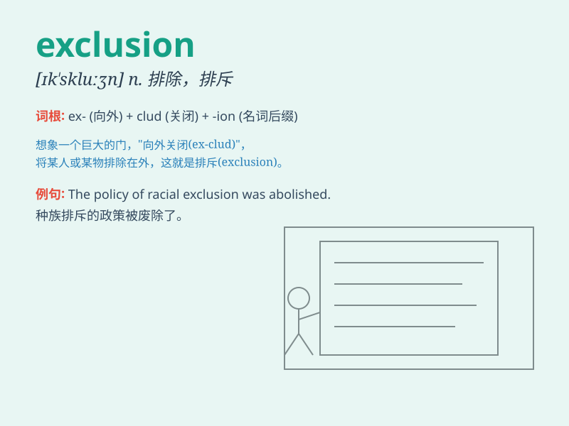

## exclusion

**英音:** _[ɪk\'skluːʒ(ə)n; ek-]_ **美音:**
_[ɪk\'skluʒn]_

**译义:** *n.排除,除外,被排除在外的事物*

### 短语

+ **exclusion clause:** _除外条款_

+ **exclusion zone:** _禁区；隔离区_

+ **mutual exclusion:** _互斥；互相排斥_

+ **exclusion principle:** _排他原理_

+ **social exclusion:** _社会排斥_

### 例句

#### 例句1

> **The exclusion of certain groups from the event was
controversial.**

**中文翻译:** 将某些群体排除在活动之外是有争议的。

**单词释义:** 排除；排斥

#### 例句2

> **His exclusion from the team came as a surprise to everyone.**

**中文翻译:** 他被排除在球队之外让每个人都感到惊讶。

**单词释义:** 排除；不让......进入

#### 例句3

> **The policy aims at the exclusion of illegal immigrants.**

**中文翻译:** 该政策旨在排除非法移民。

**单词释义:** 排除；剔除

### 背诵小故事

> A king had a secret garden. To protect it, he set up strict rules for
exclusion. Only those with special permission could enter. Anyone else
was kept out. This shows the meaning of exclusion - keeping someone or
something out.

**一位国王有一个秘密花园。为了保护它，他制定了严格的排斥规则。只有获得特别许可的人才能进入。其他人都被拒之门外。这体现了'exclusion'（排斥、排除）的含义------将某人或某物拒之门外。**

### 图义

