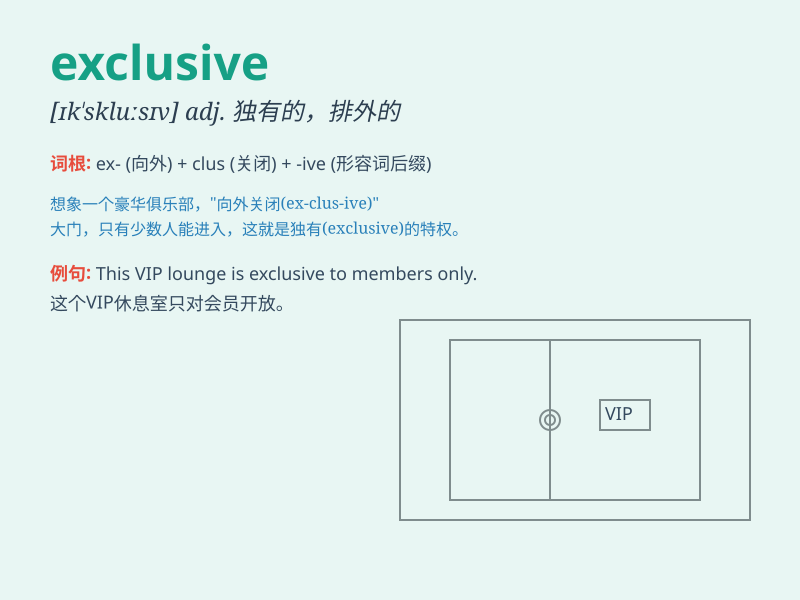

## exclusive

**英音:** _[ɪk\'skluːsɪv; ek-]_ **美音:**
_[ɪk\'sklusɪv]_

**译义:** *adj.排外的,孤高的,唯我独尊的,独占的,唯一的,高级的*

### 短语

+ **exclusive interview:** _独家采访_

+ **exclusive right:** _专有权_

+ **exclusive club:** _高级俱乐部；私人俱乐部_

+ **exclusive offer:** _独家优惠_

+ **exclusive focus:** _唯一焦点；专注于_

### 例句

#### 例句1

> **This hotel offers exclusive services for VIP guests.**

**中文翻译:** 这家酒店为 VIP 客人提供专属服务。

**单词释义:** 专属的；独有的

#### 例句2

> **The report was based on exclusive information.**

**中文翻译:** 该报告基于独家信息。

**单词释义:** 独家的

#### 例句3

> **She belongs to an exclusive club.**

**中文翻译:** 她属于一个高级俱乐部。

**单词释义:** 高级的；排他的

### 背诵小故事

> 有一天，小明参加了一个高级派对，门口保安说这是 exclusive
的，只有受到特别邀请的人才能进入。小明拿出邀请函，顺利进入，享受了专属的服务和体验。原来
exclusive 就是排他的、独有的意思。

**有一天，小明参加了一个只有受到特别邀请才能进入的高级派对，小明凭借邀请函顺利进入并享受专属服务，以此体现
exclusive 排他的、独有的含义。**

### 图义

