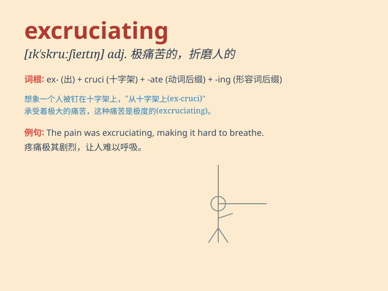

## excruciating

**英音:** _[ɪk\'skruːʃɪeɪtɪŋ]_ **美音:**
_[ɪk\'skruʃɪetɪŋ]_

**译义:** *adj.极痛苦的,折磨人的*

### 短语

+ **excruciating pain:** _极度的疼痛_

+ **excruciating boredom:** _难以忍受的无聊_

+ **excruciating experience:** _痛苦的经历_

+ **excruciating wait:** _漫长难熬的等待_

+ **excruciating choice:** _艰难的抉择_

### 例句

#### 例句1

> **The headache was excruciating.**

**中文翻译:** 头痛得难以忍受。

**单词释义:** 极其痛苦的；剧痛的

#### 例句2

> **She went through an excruciating divorce.**

**中文翻译:** 她经历了一场痛苦的离婚。

**单词释义:** 极其痛苦的

#### 例句3

> **The waiting was excruciating for him.**

**中文翻译:** 等待对他来说是煎熬。

**单词释义:** 令人极度痛苦的

### 背诵小故事

> I was climbing a mountain and got injured. The pain was excruciating.
It felt like thousands of needles were stabbing me. I couldn\'t move and
had to wait for help.

**我在爬山时受伤了。疼痛是极度的。感觉就像有成千上万根针在刺我。我无法移动，只能等待救援。**

### 图义

