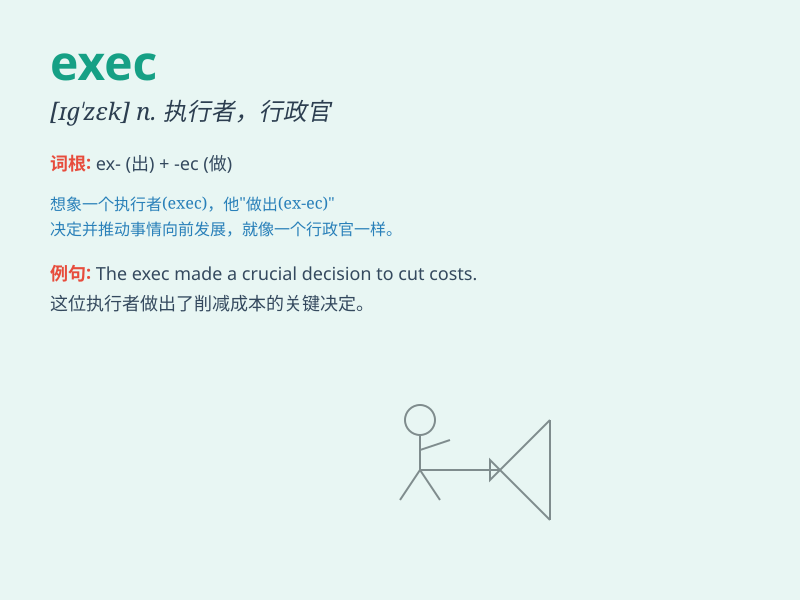

## exec

**英音:** _[ɪɡˈzek]_ **美音:** _[ɪɡˈzek]_

**译义:** * execute实行;executive 实行的*

### 短语

+ **exec function:** _执行函数_

+ **exec order:** _执行命令_

+ **exec plan:** _执行计划_

+ **executive committee:** _执行委员会_

+ **exec file:** _执行文件_

### 例句

#### 例句1

> **The exec ordered the immediate implementation of the new
plan.**

**中文翻译:** 执行官下令立即实施新计划。

**单词释义:** 主管；经理

#### 例句2

> **The software exec presented the company\'s latest achievements at
the conference.**

**中文翻译:** 软件高管在会上介绍了公司的最新成果。

**单词释义:** 主管；经理

#### 例句3

> **He was promoted to an exec position within the company.**

**中文翻译:** 他被提升为公司内的执行职务。

**单词释义:** 主管；经理

### 背诵小故事

> Imagine an executive in a big company. He\'s always busy making
important decisions and giving orders. We call such a person an
\'exec\'.

**想象一家大公司里的一位高管。他总是忙于做重要决定和下达命令。我们称这样的人是'exec（主管；经理）'。**

### 图义

