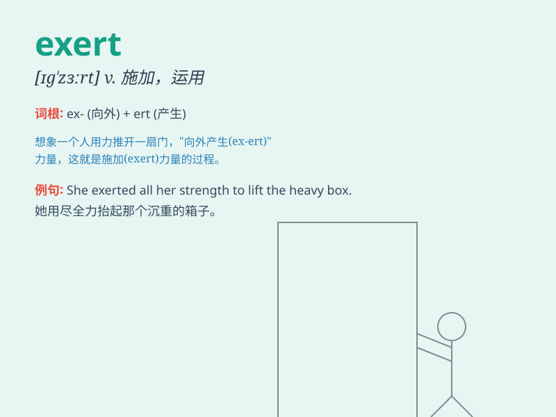

## exert

**英音:** _[ɪg\'zɜːt; eg-]_ **美音:** _[ɪɡ\'zɝt]_

**译义:** *vt.尽(力),施加(压力等),努力v.发挥,竭尽全力,尽*

### 短语

+ **exert oneself:** _努力；尽力_

+ **exert influence:** _施加影响_

+ **exert pressure:** _施加压力_

+ **exert control:** _实施控制_

+ **exert an effect:** _产生效果_

### 例句

#### 例句1

> **He exerted all his strength to lift the heavy box.**

**中文翻译:** 他用尽全身的力气才把那个沉重的箱子抬起来。

**单词释义:** 运用；施加

#### 例句2

> **The coach exerted a lot of pressure on the team to win the
championship.**

**中文翻译:** 教练为了夺冠给球队施加了很大的压力。

**单词释义:** 施加（影响、压力等）

#### 例句3

> **You need to exert yourself if you want to pass the exam.**

**中文翻译:** 如果你想通过考试，你就需要努力。

**单词释义:** 努力；尽力

### 背诵小故事

>
想象一下，大力士在举重比赛中，用尽全力（exert）去举起杠铃。他肌肉紧绷，汗流浃背，把自己所有的力量都发挥出来，只为赢得比赛。这就是
exert ，表示尽力、发挥、运用。

**想象大力士在举重比赛中尽力发挥力量的情景来辅助记忆单词
exert，意为尽力、发挥、运用**

### 图义

