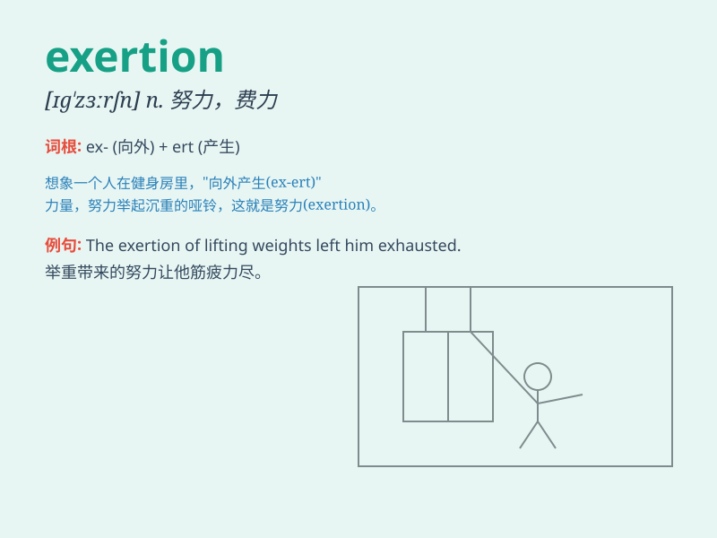

## exertion

**英音:** _[ɪɡ\'zɜːʃn]_ **美音:** _[ɪɡ\'zɝʃən]_

**译义:** *n.尽力,努力,发挥,行使,运用*

### 短语

+ **physical exertion:** _体力消耗_

+ **mental exertion:** _脑力消耗_

+ **excessive exertion:** _过度用力；过度劳累_

+ **minimal exertion:** _最小的努力；极小的消耗_

+ **strenuous exertion:** _艰苦的努力；费力的活动_

### 例句

#### 例句1

> **The athlete collapsed from exhaustion after the exertion of the
race.**

**中文翻译:** 比赛结束后，这位运动员因精疲力尽而倒下。

**单词释义:** 努力；费力；尽力

#### 例句2

> **It took a lot of exertion to move the heavy furniture.**

**中文翻译:** 搬动那些沉重的家具需要费很大的力气。

**单词释义:** 费力；用力

#### 例句3

> **Physical exertion can sometimes lead to muscle soreness.**

**中文翻译:** 体力消耗有时会导致肌肉酸痛。

**单词释义:** 用力；费力

### 背诵小故事

> A tired athlete was on the track. Despite the pain, he made a huge
exertion to cross the finish line. His determination and effort showed
what exertion truly means - using all your strength and energy.

**一位疲惫的运动员在跑道上。尽管疼痛，他还是竭尽全力冲过了终点线。他的决心和努力展现了'exertion'的真正含义------用尽所有的力量和精力。**

### 图义

