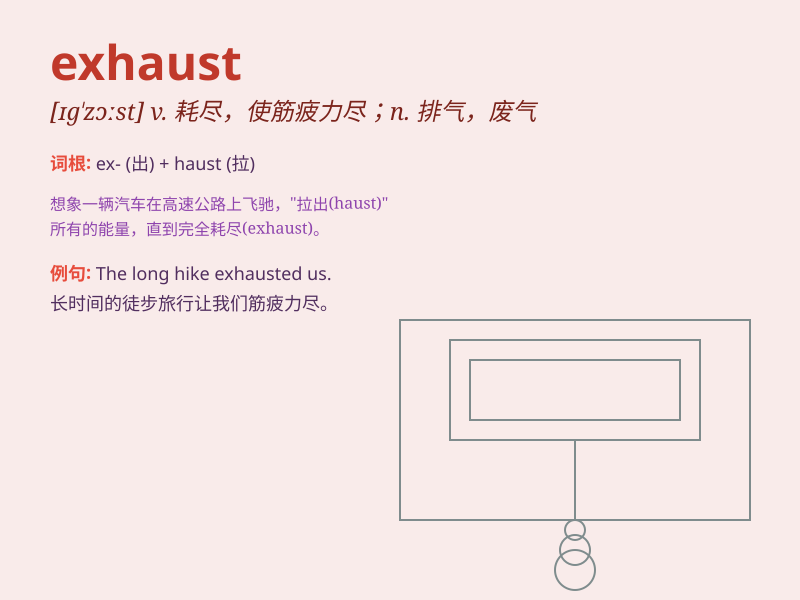

## exhaust

**英音:** _[ɪg\'zɔːst; eg-]_ **美音:** _[ɪɡ\'zɔst]_

**译义:**
*vt.用尽,耗尽,抽完,使精疲力尽vi.排气n.排气,排气装置adj.用不完的,不会枯竭的*

### 短语

+ **exhaust pipe:** _排气管_

+ **exhaust fumes:** _废气_

+ **exhaust system:** _排气系统_

+ **be exhausted from:** _因\...\...而筋疲力尽_

+ **exhaust oneself:** _使自己筋疲力尽_

### 例句

#### 例句1

> **The long race exhausted her.**

**中文翻译:** 漫长的比赛让她筋疲力尽。

**单词释义:** 使精疲力竭

#### 例句2

> **The car exhaust fumes are polluting the air.**

**中文翻译:** 汽车排出的废气正在污染空气。

**单词释义:** 尾气

#### 例句3

> **I have exhausted all my ideas for the project.**

**中文翻译:** 我已经用尽了对该项目的所有想法。

**单词释义:** 用尽

### 背诵小故事

>
想象一辆赛车在赛道上疯狂疾驰，跑了无数圈。它的引擎不断工作，最终不堪重负。这个引擎就像被\'exhaust\'了，消耗殆尽，没有力气再跑了。

**想象一辆赛车过度使用，引擎消耗殆尽，来辅助理解'exhaust'有使精疲力竭；耗尽的意思。**

### 图义

