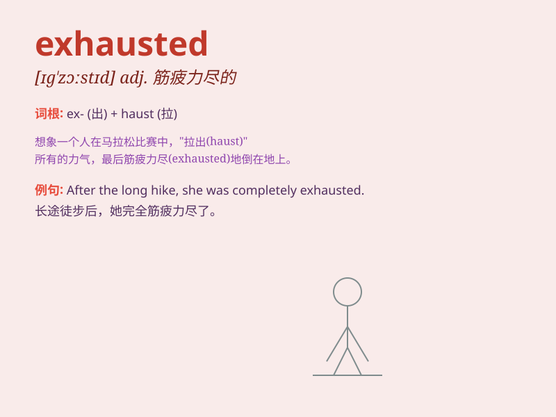

## exhausted

**英音:** _[ɪɡ\'zɔːstɪd]_ **美音:** _[ɪɡ\'zɔstɪd]_

**译义:** *adj.耗尽的,疲惫的*

### 短语

+ **be exhausted from:** _因\...\...而筋疲力尽_

+ **feel exhausted:** _感到精疲力竭_

+ **utterly exhausted:** _极度疲惫_

+ **mentally exhausted:** _精神疲惫_

+ **physically exhausted:** _身体疲惫_

### 例句

#### 例句1

> **After running the marathon, she was completely exhausted.**

**中文翻译:** 跑完马拉松后，她已经筋疲力尽了。

**单词释义:** 精疲力竭的

#### 例句2

> **He looked exhausted after working for 12 hours straight.**

**中文翻译:** 连续工作12个小时后，他看起来很疲惫。

**单词释义:** 疲惫不堪的

#### 例句3

> **The exhausted soldiers lay down to rest.**

**中文翻译:** 疲惫不堪的士兵们躺下休息。

**单词释义:** 筋疲力尽的

### 背诵小故事

> A hardworking athlete ran many miles in a race. After crossing the
finish line, he was completely exhausted. He could hardly move and
needed to lie down to rest.

**一位勤奋的运动员在一场比赛中跑了很多英里。冲过终点线后，他完全精疲力竭了。他几乎动弹不得，需要躺下来休息。**

### 图义

