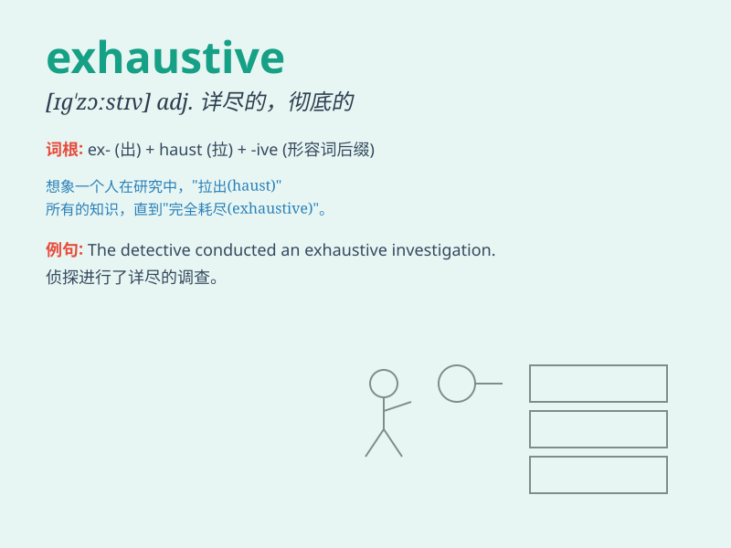

## exhaustive

**英音:** _[ɪg\'zɔːstɪv; eg-]_ **美音:** _[ɪg\'zɔstɪv]_

**译义:** *adj.无遗漏的,彻底的,详尽的,无遗的*

### 短语

+ **exhaustive research:** _详尽的研究_

+ **exhaustive list:** _详尽的清单_

+ **exhaustive search:** _彻底的搜查_

+ **exhaustive study:** _全面的研究_

+ **exhaustive examination:** _详尽的检查_

### 例句

#### 例句1

> **The research was exhaustive, covering every possible aspect of
the topic.**

**中文翻译:** 这项研究是详尽的，涵盖了该主题的每一个可能的方面。

**单词释义:** 详尽无遗的

#### 例句2

> **We conducted an exhaustive search for the missing documents.**

**中文翻译:** 我们对丢失的文件进行了彻底的搜索。

**单词释义:** 彻底的

#### 例句3

> **The detective\'s investigation was exhaustive, leaving no stone
unturned.**

**中文翻译:** 侦探的调查非常彻底，不遗余力。

**单词释义:** 详尽至极的

### 背诵小故事

>
想象一位探险家在沙漠中寻找宝藏，他翻遍了每一个沙丘，检查了每一处洞穴，用尽了所有可能的方法，这种全面彻底的探索就是\'exhaustive\'。

**想象一位探险家在沙漠中全面彻底的寻找宝藏，以此来辅助记忆\'exhaustive\'（详尽的；彻底的）这个单词。**

### 图义

