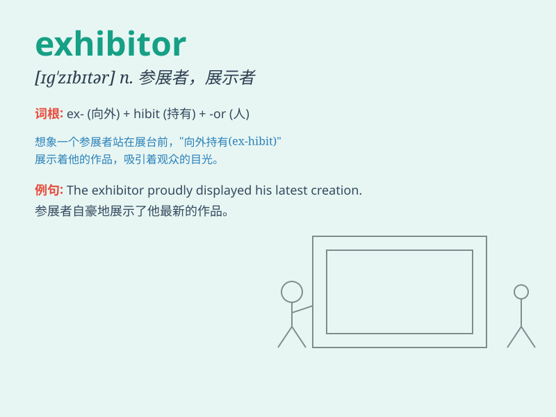

## exhibitor

**英音:** _[ɪg\'zɪbɪtə; eg-]_ **美音:** _[ɪg\'zɪbɪtɚ]_

**译义:** *n.展出者,显示者*

### 短语

+ **trade exhibitor:** _贸易参展商_

+ **major exhibitor:** _主要参展商_

+ **exhibitor booth:** _参展商展位_

+ **international exhibitor:** _国际参展商_

+ **exhibitor list:** _参展商名单_

### 例句

#### 例句1

> **The exhibitor displayed a wide range of products at the trade
show.**

**中文翻译:** 参展商在展会上展示了多种产品。

**单词释义:** 参展商

#### 例句2

> **The art exhibitor carefully arranged the paintings for the
exhibition.**

**中文翻译:** 艺术参展商精心布置了展览的画作。

**单词释义:** 参展者

#### 例句3

> **The exhibitor was busy answering questions from potential
customers.**

**中文翻译:** 参展商忙着回答潜在客户的提问。

**单词释义:** 参展商

### 背诵小故事

> A young artist wanted to show his paintings. But he needed an
exhibitor. Finally, he found one who helped him display the art in a big
hall. The exhibitor made his dream come true.

**一位年轻的艺术家想要展示他的画作。但他需要一个展出者。最后，他找到了一个在一个大展厅帮他展出作品的展出者。这个展出者让他的梦想成真了。**

### 图义

