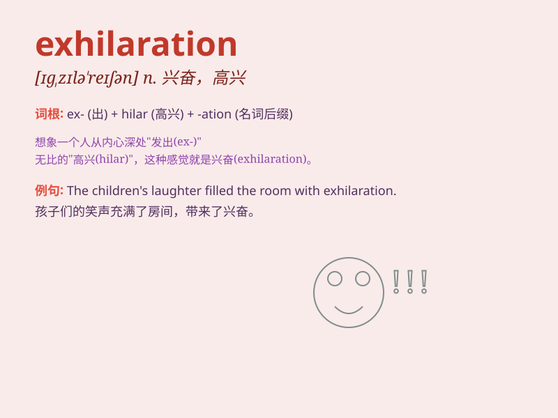

## exhilaration

**英音:** _[ɪgzɪlə\'reɪʃ(ə)n; eg-]_ **美音:**
_[ɪg,zɪlə\'reʃən]_

**译义:** *n.令人高兴,愉快*

### 短语

+ **feel exhilaration:** _感到兴奋_

+ **moment of exhilaration:** _兴奋的时刻_

+ **exhilaration of victory:** _胜利的喜悦_

+ **indescribable exhilaration:** _难以形容的兴奋_

+ **experience exhilaration:** _体验兴奋_

### 例句

#### 例句1

> **The feeling of exhilaration after winning the race was
overwhelming.**

**中文翻译:** 赢得比赛后的兴奋感是压倒性的。

**单词释义:** 兴奋；高兴

#### 例句2

> **She experienced a rush of exhilaration when she received the good
news.**

**中文翻译:** 当她收到这个好消息时，她感到一阵兴奋。

**单词释义:** 兴奋；愉快

#### 例句3

> **The view from the mountain top brought a sense of
exhilaration.**

**中文翻译:** 从山顶看到的景色给人一种心旷神怡的感觉。

**单词释义:** 兴奋；激昂

### 背诵小故事

> A young man went on a thrilling adventure. He climbed mountains,
crossed rivers, and felt a rush of joy and excitement. This feeling was
called exhilaration. It made him want to keep exploring and having fun.

**一个年轻人去进行了一场惊险刺激的冒险。他爬山、过河，并感受到了一阵喜悦和兴奋。这种感觉就叫做兴奋。这让他想要不断探索并享受快乐。**

### 图义

