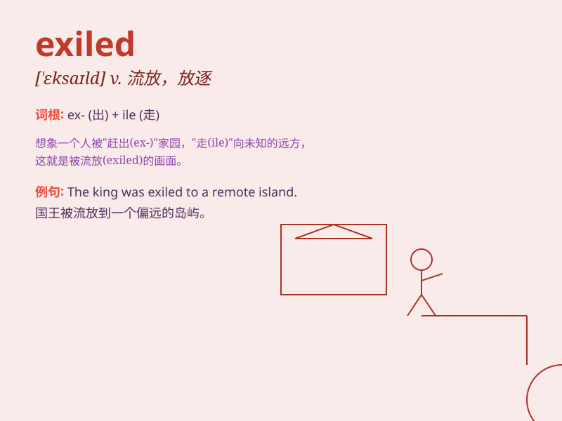

## exiled

**英音:** _[ˈeksaɪld]_ **美音:** _[ˈeksaɪld]_

**译义:** *adj.流亡的,放逐的*

### 短语

+ **be exiled from:** _被从\...\...流放_

+ **political exiled:** _政治流亡者_

+ **exiled king:** _流亡的国王_

+ **exiled prince:** _流亡的王子_

+ **exiled noble:** _流亡的贵族_

### 例句

#### 例句1

> **He was exiled for political reasons.**

**中文翻译:** 他因政治原因被流放。

**单词释义:** 被流放；被放逐

#### 例句2

> **The king exiled the traitor from the kingdom.**

**中文翻译:** 国王将叛徒逐出了王国。

**单词释义:** 驱逐；放逐

#### 例句3

> **She felt exiled in a foreign land.**

**中文翻译:** 她感觉自己被放逐到了异国他乡。

**单词释义:** （感觉）被流放；被抛弃

### 背诵小故事

> A brave king was wrongly accused and exiled. He had to leave his
kingdom and face many difficulties. But he never gave up and finally
proved his innocence and returned.

**一位勇敢的国王被错误地指控并遭到流放。他不得不离开自己的王国，面临诸多困难。但他从未放弃，最终证明了自己的清白并归来。**

### 图义

