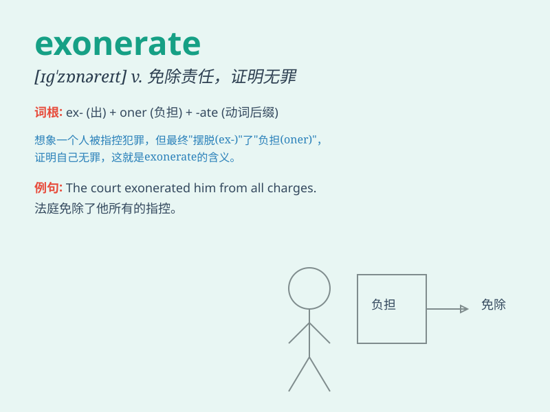

## exonerate

**英音:** _[ɪg\'zɒnəreɪt; eg-]_ **美音:**
_[ɪɡ\'zɑnəret]_

**译义:** *vt.免除,证明无罪*

### 短语

+ **exonerate someone from blame:** _使某人免受责备_

+ **be exonerated of the charge:** _被免除指控_

+ **exonerate oneself:** _为自己开脱_

+ **fully exonerate:** _完全免除（责任等）_

+ **exonerate completely:** _彻底免除_

### 例句

#### 例句1

> **The evidence exonerated him from all charges.**

**中文翻译:** 证据证明他无罪。

**单词释义:** 证明无罪；免除责任

#### 例句2

> **The investigation exonerated the police officer of any
wrongdoing.**

**中文翻译:** 调查证实该警官没有任何不当行为。

**单词释义:** 证明无罪；免除责任

#### 例句3

> **New evidence was found to exonerate the defendant.**

**中文翻译:** 找到了新的证据来证明被告无罪。

**单词释义:** 证明无罪；免除责任

### 背诵小故事

> A man was wrongly accused of a crime. But new evidence emerged to
exonerate him. It proved he was not at the scene and had nothing to do
with it. Finally, justice was served and he was freed.

**一个男人被错误地指控犯罪。但新的证据出现为他洗清了罪名。这证明他当时不在现场，与案件毫无关系。最终，正义得到伸张，他被释放了。**

### 图义

