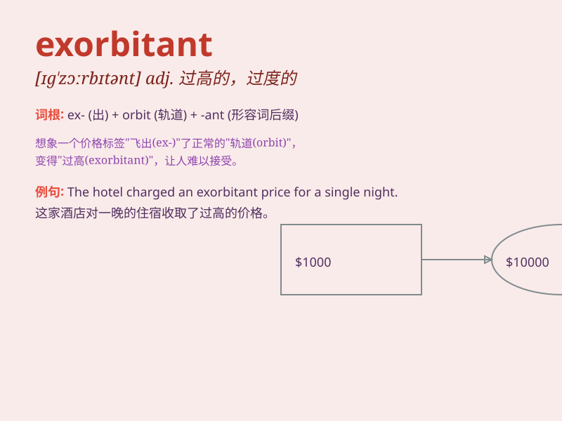

## exorbitant

**英音:** _[ɪg\'zɔːbɪt(ə)nt]_ **美音:**
_[ɪɡ\'zɔrbɪtənt]_

**译义:** *adj.过度的,过高的,昂贵的*

### 短语

+ **exorbitant price:** _过高的价格_

+ **exorbitant rent:** _过高的租金_

+ **exorbitant demand:** _过分的要求_

+ **exorbitant cost:** _过高的成本_

+ **exorbitant fee:** _过高的费用_

### 例句

#### 例句1

> **The price of the hotel room was exorbitant.**

**中文翻译:** 这家酒店房间的价格过高。

**单词释义:** 过高的；过分的

#### 例句2

> **He was shocked by the exorbitant cost of medical treatment.**

**中文翻译:** 他被高昂的医疗费用震惊了。

**单词释义:** 过高的；昂贵的

#### 例句3

> **The rent for that apartment is exorbitant, considering its
location.**

**中文翻译:** 考虑到那个公寓的位置，租金过高了。

**单词释义:** 过高的；离谱的

### 背诵小故事

> A poor man needed a new bike. But the price in the store was
exorbitant. It was like a crazy dream. He had to save for ages. Finally,
he found a better deal.

**一个穷人需要一辆新自行车。但商店里的价格高得离谱。就像一个疯狂的梦。他不得不攒钱很久。最后，他找到了更划算的。**

### 图义

