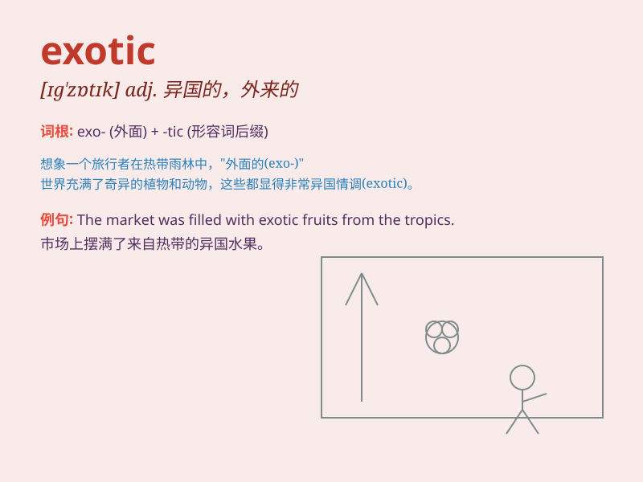

## exotic

**英音:** _[ɪg\'zɒtɪk; eg-]_ **美音:** _[ɪɡ\'zɑtɪk]_

**译义:** *adj.异国情调的,外来的,奇异的*

### 短语

+ **exotic plant:** _异国植物；外来植物_

+ **exotic destination:** _充满异国情调的目的地_

+ **exotic food:** _异国风味的食物；奇特的食物_

+ **exotic culture:** _异域文化；外来文化_

+ **exotic animal:** _外来动物；奇异的动物_

### 例句

#### 例句1

> **The market was filled with exotic fruits from around the
world.**

**中文翻译:** 这个市场充满了来自世界各地的奇异水果。

**单词释义:** 奇异的；外来的

#### 例句2

> **She wore an exotic dress that caught everyone\'s attention.**

**中文翻译:** 她穿着一件引人注目的异国情调的连衣裙。

**单词释义:** 具有异国情调的

#### 例句3

> **The garden was filled with exotic flowers and plants.**

**中文翻译:** 花园里满是奇异的花卉和植物。

**单词释义:** 奇异的；外来的

### 背诵小故事

> A traveler went to a faraway land and saw many exotic plants and
animals. The colorful birds, strange fruits, and unique flowers were all
so fascinating. These things were very different from what he was used
to at home.

**一位旅行者去了一个遥远的地方，看到了许多奇异的植物和动物。色彩斑斓的鸟儿、奇怪的水果和独特的花朵都非常迷人。这些东西都与他在家乡习惯见到的大不相同。**

### 图义

