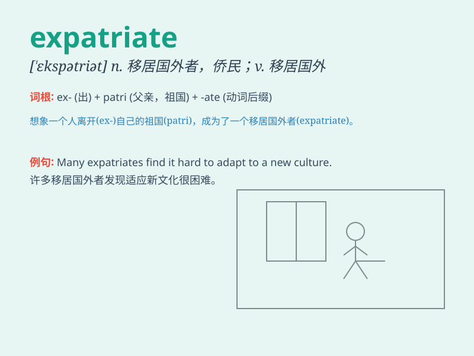

## expatriate

**英音:** _[ɪks\'pætrɪət; -\'peɪtrɪət; eks-]_ **美音:**
_[,ɛks\'petrɪət]_

**译义:** *vt.逐出国外,脱离国籍,放逐vi.移居国外n.亡命国外者*

### 短语

+ **expatriate worker:** _外派员工_

+ **expatriate community:** _侨民社区_

+ **expatriate life:** _侨居生活_

+ **forced expatriate:** _被迫移居国外_

+ **voluntary expatriate:** _自愿移居国外_

### 例句

#### 例句1

> **He decided to expatriate to a warmer country for a better quality
of life.**

**中文翻译:** 他决定移居到一个更温暖的国家以获得更好的生活质量。

**单词释义:** 移居国外；放逐

#### 例句2

> **The company sent several employees to work abroad as
expatriates.**

**中文翻译:** 公司派遣了几名员工到国外工作成为侨民。

**单词释义:** 侨民；移居国外者

#### 例句3

> **She felt like an expatriate in the strange city.**

**中文翻译:** 她在这个陌生的城市里感觉自己像个侨民。

**单词释义:** 侨民；移居国外者

### 背诵小故事

> A scientist was forced to expatriate from his homeland due to
political reasons. He left with a heavy heart, seeking a new life
abroad. But he always missed his home. Remember, expatriate means to
leave one\'s country.

**一位科学家因政治原因被迫离开祖国成为侨民。他怀着沉重的心情离开，在国外寻求新生活。但他总是思念家乡。记住，expatriate
意思是移居国外；放逐。**

### 图义

