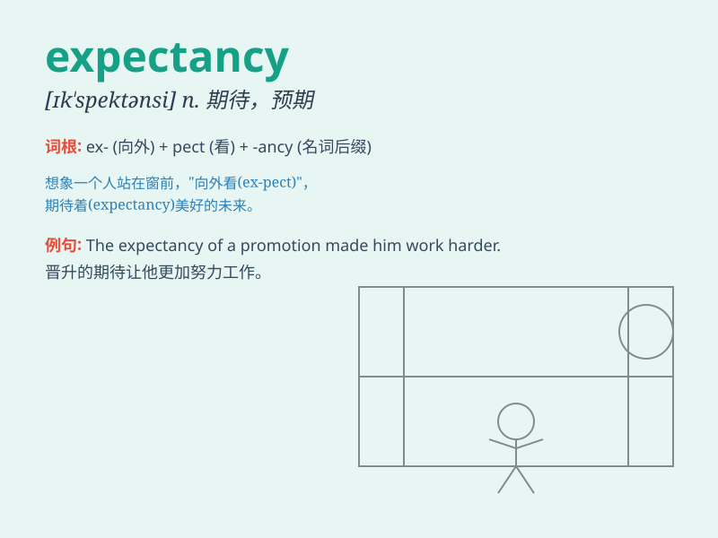

## expectancy

**英音:** _[ɪk\'spekt(ə)nsɪ; ek-]_ **美音:**
_[ɪk\'spɛktənsi]_

**译义:** *n.期待,期望*

### 短语

+ **life expectancy:** _预期寿命；平均寿命_

+ **growth expectancy:** _增长预期_

+ **expectancy value:** _期望值_

+ **job expectancy:** _工作预期_

+ **consumer expectancy:** _消费者预期_

### 例句

#### 例句1

> **The expectancy of a successful outcome kept them motivated.**

**中文翻译:** 成功结果的预期使他们保持了积极性。

**单词释义:** 预期；期望

#### 例句2

> **Life expectancy has increased significantly over the past
century.**

**中文翻译:** 在过去的一个世纪里，预期寿命大幅提高。

**单词释义:** 预期寿命

#### 例句3

> **There was a high expectancy among the fans for the team\'s
performance.**

**中文翻译:** 球迷们对球队的表现抱有很高的期望。

**单词释义:** 期望

### 背诵小故事

> A young athlete trained hard every day with expectancy of winning the
championship. He believed his efforts would lead to success. Finally,
his dream came true.

**一位年轻的运动员每天刻苦训练，怀着赢得冠军的期望。他相信自己的努力会带来成功。最终，他的梦想成真了。**

### 图义

