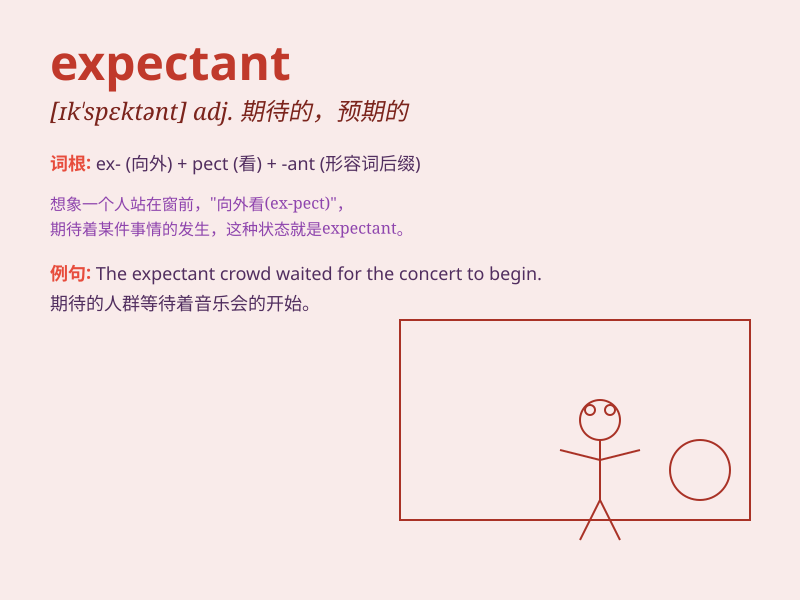

## expectant

**英音:** _[ɪk\'spekt(ə)nt; ek-]_ **美音:**
_[ɪk\'spɛktənt]_

**译义:**
*adj.预期的,期待的,[律](有继承权而)期待占有的n.预期者,期待者*

### 短语

+ **expectant mother:** _孕妇_

+ **expectant look:** _期待的神情_

+ **expectant audience:** _满怀期待的观众_

+ **expectant attitude:** _期待的态度_

+ **expectant hope:** _期待的希望_

### 例句

#### 例句1

> **The expectant mother was filled with excitement as she awaited
the birth of her baby.**

**中文翻译:** 这位准妈妈怀着期待，等待着宝宝的出生，内心充满了兴奋。

**单词释义:** 怀着期望的，期待的（指准妈妈）

#### 例句2

> **The expectant crowd waited patiently for the concert to
begin.**

**中文翻译:** 满怀期待的人群耐心地等待着音乐会开始。

**单词释义:** 期待的，盼望的（指人群）

#### 例句3

> **He looked at me with expectant eyes, hoping for good news.**

**中文翻译:** 他用期待的眼神看着我，希望能听到好消息。

**单词释义:** 期待的，期望的（指眼神）

### 背诵小故事

> A woman stands at the hospital door, her face filled with hope and
anticipation. She is expectant, waiting for the arrival of her new baby.
This moment of waiting and looking forward is what \'expectant\' means.

**一位女士站在医院门口，脸上充满希望和期待。她满怀期待，等待着新生命的降临。这种等待和期盼的时刻就是'expectant'的含义。**

### 图义

