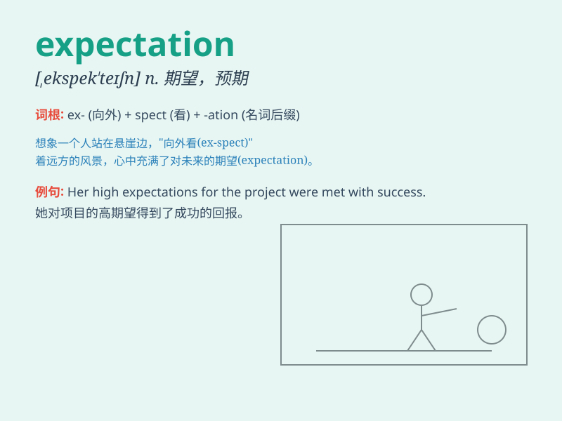

## expectation

**英音:** _[ekspek\'teɪʃ(ə)n]_ **美音:**
_[,ɛkspɛk\'teʃən]_

**译义:** *n.期待,预料,指望,展望,[数]期望(值)*

### 短语

+ **beyond expectation:** _出乎意料；超出预期_

+ **live up to expectation:** _达到期望；不负众望_

+ **against expectation:** _与预期相反_

+ **fall short of expectation:** _未达到期望；令人失望_

+ **expectation of life:** _预期寿命_

### 例句

#### 例句1

> **The expectation of a better future keeps him motivated.**

**中文翻译:** 对更美好未来的期待使他保持积极性。

**单词释义:** 期待；期望

#### 例句2

> **Her performance exceeded all expectations.**

**中文翻译:** 她的表现超出了所有的预期。

**单词释义:** 预期；预料

#### 例句3

> **There was a great expectation for the new movie.**

**中文翻译:** 人们对这部新电影抱有很大的期望。

**单词释义:** 期望；盼望

### 背诵小故事

> A young boy had an expectation of getting a bike on his birthday. He
imagined riding it freely. But when the day came, there was no bike. His
expectation was not met.

**一个小男孩期待在生日时能得到一辆自行车。他想象着能自由地骑行。但当生日那天到来时，却没有自行车。他的期望落空了。**

### 图义

