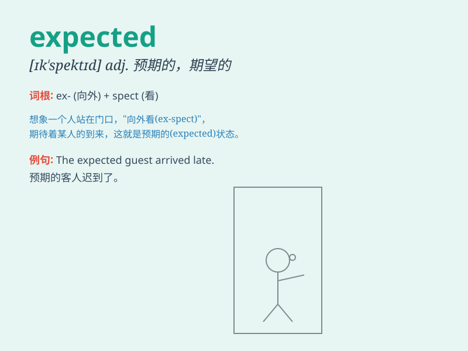

## expected

**英音:** _[ɪkˈspɛktɪd]_ **美音:** _[ɪkˈspɛktɪd]_

**译义:** *adj.预期的，预料中的；n.预期的事物（expected thing）*

### 短语

+ **expected value:** _期望值_

+ **expected return:** _预期回报_

+ **expected outcome:** _预期结果_

+ **expected behavior:** _预期行为_

+ **as expected:** _正如预期的那样_

### 例句

#### 例句1

> **The expected delivery date is next week.**

**中文翻译:** 预期的交货日期是下周。

**单词释义:** 预期的；预料的

#### 例句2

> **It was much better than we expected.**

**中文翻译:** 这比我们预料的要好得多。

**单词释义:** 预料；预期

#### 例句3

> **The results were not as expected.**

**中文翻译:** 结果不像预期的那样。

**单词释义:** 预期的；期望的

### 背诵小故事

> A man was waiting at the train station. He had expected the train to
arrive at 3 pm, but it was delayed. He was very anxious. Finally, the
train came at 5 pm.

**一个男人在火车站等待。他原本预期火车下午 3
点到达，但火车晚点了。他非常焦虑。最终，火车在下午 5 点来了。**

### 图义

