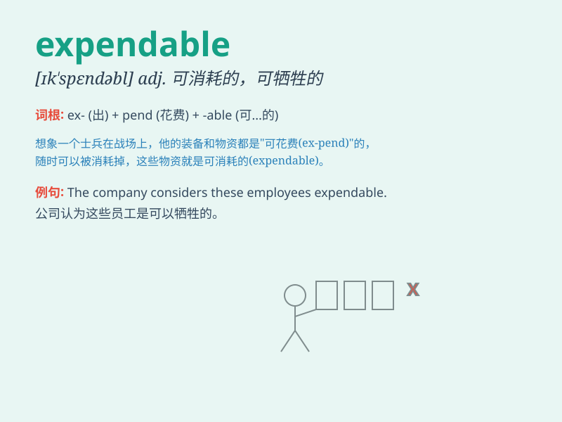

## expendable

**英音:** _[ɪk\'spendəb(ə)l; ek-]_ **美音:**
_[ɪk\'spɛndəbl]_

**译义:** *n.消耗品,可牺牲的,可花费的,可消耗的*

### 短语

+ **expendable resources:** _可消耗的资源_

+ **expendable income:** _可支配收入_

+ **expendable items:** _可消耗品_

+ **considered expendable:** _被认为是可牺牲的_

+ **expendable workforce:** _可裁减的劳动力_

### 例句

#### 例句1

> **In a war, some soldiers may be considered expendable for the
greater strategic goal.**

**中文翻译:**
在战争中，为了更大的战略目标，一些士兵可能会被认为是可牺牲的。

**单词释义:** 可牺牲的；可消耗的

#### 例句2

> **Expendable resources should be used carefully during a
project.**

**中文翻译:** 在一个项目中，可消耗的资源应该谨慎使用。

**单词释义:** 可消耗的

#### 例句3

> **The company regarded these old machines as expendable and
replaced them with new ones.**

**中文翻译:** 公司认为这些旧机器是可抛弃的，并用新的机器取代了它们。

**单词释义:** 可抛弃的；可废弃的

### 背诵小故事

> In a dangerous mission, the team had some expendable members. They
were seen as easily sacrificed for the greater goal. But one of them
refused to be treated as such and proved his worth. Expendable means
capable of being sacrificed or used up.

**在一次危险的任务中，团队有一些可牺牲的成员。他们被视为为了更大的目标容易被舍弃的。但其中一人拒绝被这样对待，并证明了自己的价值。Expendable
意思是可牺牲的；可消耗的。**

### 图义

