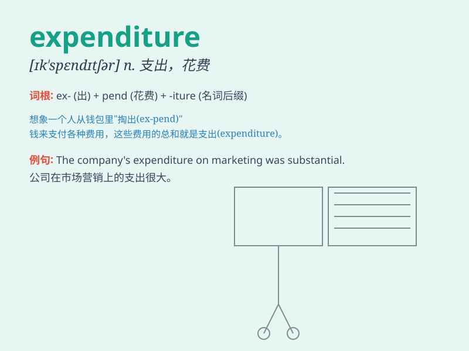

## expenditure

**英音:** _[ɪk\'spendɪtʃə; ek-]_ **美音:**
_[ɪk\'spɛndɪtʃɚ]_

**译义:** *n.支出,花费*

### 短语

+ **public expenditure:** _公共开支_

+ **capital expenditure:** _资本支出_

+ **government expenditure:** _政府支出_

+ **household expenditure:** _家庭支出_

+ **operating expenditure:** _运营开支_

### 例句

#### 例句1

> **The company\'s expenditure on research and development has
increased significantly this year.**

**中文翻译:** 这家公司今年在研发方面的支出大幅增加。

**单词释义:** 支出；花费

#### 例句2

> **We need to reduce our monthly expenditure to save more money.**

**中文翻译:** 我们需要减少每月的开支以存更多的钱。

**单词释义:** 开支；费用

#### 例句3

> **The government\'s expenditure on education is a priority.**

**中文翻译:** 政府在教育方面的支出是一个优先事项。

**单词释义:** 支出；经费

### 背诵小故事

> A poor student had to carefully manage his expenditure. He spent
money only on necessary things like textbooks. But one day, he
accidentally overspent on a party. Now he realizes the importance of
controlling expenditure.

**一个贫困的学生不得不小心管理他的开支。他只把钱花在像教科书这样的必需品上。但有一天，他不小心在一个聚会上超支了。现在他意识到控制开支的重要性。**

### 图义

