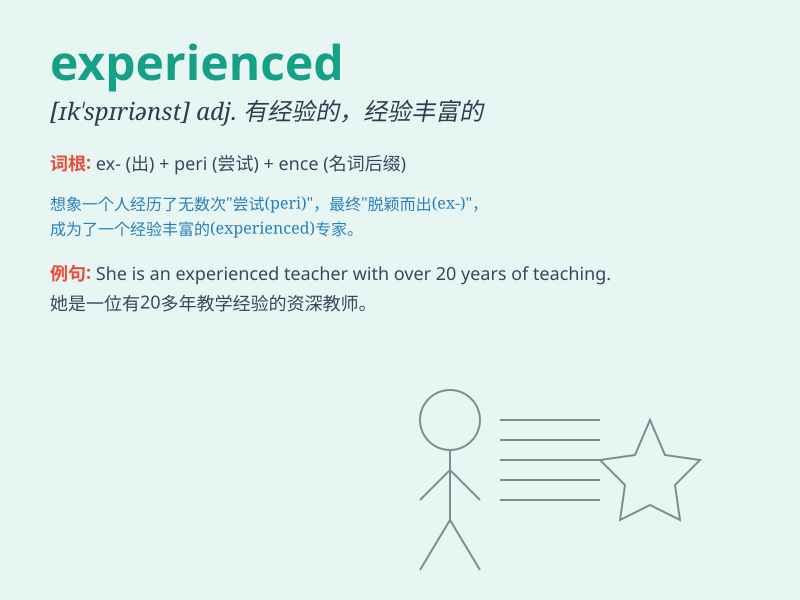

## experienced

**英音:** _[ɪk\'spɪərɪənst]_ **美音:** _[ɪkˈspɪriənst]_

**译义:** *v.经历adj.富有经验的*

### 短语

+ **experienced worker:** _有经验的工人_

+ **experienced driver:** _经验丰富的司机_

+ **experienced teacher:** _经验丰富的教师_

+ **be experienced in:** _在\...方面有经验_

+ **experienced traveller:** _有经验的旅行者_

### 例句

#### 例句1

> **He is an experienced driver.**

**中文翻译:** 他是一位经验丰富的司机。

**单词释义:** 经验丰富的

#### 例句2

> **The experienced teacher knows how to handle difficult
students.**

**中文翻译:** 这位经验丰富的老师知道如何应对难管的学生。

**单词释义:** 经验丰富的

#### 例句3

> **She has experienced many ups and downs in her life.**

**中文翻译:** 她在生活中经历了许多起起落落。

**单词释义:** 经历（动词）

### 背诵小故事

> A young chef wanted to become experienced. He cooked every day, faced
many challenges, but never gave up. Finally, he became an experienced
chef, loved by all.

**一位年轻的厨师想要变得经验丰富。他每天做饭，面临许多挑战，但从未放弃。最终，他成为了一位经验丰富的厨师，受到所有人的喜爱。**

### 图义

