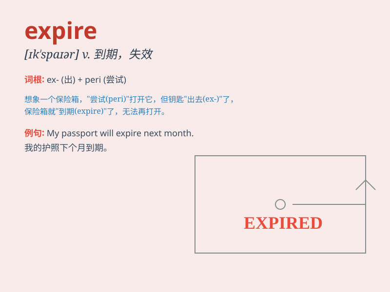

## expire

**英音:** _[ɪk\'spaɪə; ek-]_ **美音:** _[ɪk\'spaɪɚ]_

**译义:** *v.期满,终止,呼气,断气,届满*

### 短语

+ **expire date:** _到期日；有效期_

+ **expire soon:** _即将到期_

+ **expire naturally:** _自然到期_

+ **license expire:** _许可证到期_

+ **subscription expire:** _订阅到期_

### 例句

#### 例句1

> **My passport will expire next month.**

**中文翻译:** 我的护照下个月就到期了。

**单词释义:** 到期

#### 例句2

> **The contract will expire at the end of this year.**

**中文翻译:** 这份合同将在今年年底期满。

**单词释义:** 期满

#### 例句3

> **The offer to buy the house expires on Friday.**

**中文翻译:** 购买这所房子的报价周五就失效了。

**单词释义:** 失效

### 背诵小故事

> A detective was chasing a criminal. The criminal\'s visa was about to
expire. If it did, he would be caught easily. But the detective caught
him just in time before the visa expired.

**一位侦探正在追捕一名罪犯。罪犯的签证即将到期。如果到期，他会很容易被抓住。但侦探恰好在签证到期前及时抓住了他。**

### 图义

