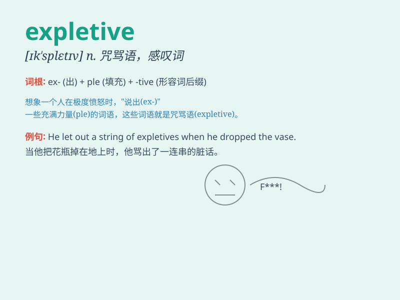

## expletive

**英音:** _[ɪk\'spliːtɪv; ek-]_ **美音:**
_[\'ɛksplətɪv]_

**译义:** *n.感叹词,咒骂语*

### 短语

+ **expletive deleted:** _被删除的咒骂语_

+ **use expletives:** _使用咒骂语_

+ **an expletive-laden speech:** _充满咒骂语的演讲_

+ **emit expletives:** _发出咒骂语_

+ **string of expletives:** _一连串的咒骂语_

### 例句

#### 例句1

> **He let out an expletive when he dropped his phone.**

**中文翻译:** 他手机掉地上时，他骂了一句脏话。

**单词释义:** 脏话；咒骂语

#### 例句2

> **The teacher scolded the student for using expletives in
class.**

**中文翻译:** 老师责备这个学生在课堂上说脏话。

**单词释义:** 脏话；诅咒语

#### 例句3

> **Her speech was peppered with expletives, which shocked the
audience.**

**中文翻译:** 她的演讲中夹杂着脏话，这让观众感到震惊。

**单词释义:** 咒骂语；粗话

### 背诵小故事

> A man was very angry at a meeting. He shouted some expletives like
\'Damn!\' and \'Hell!\' Everyone was shocked. Later, he regretted his
bad language. Remember, expletive means a swear word or an oath.

**一个男人在会议上非常生气。他喊出了一些像'该死！'和'见鬼！'这样的咒骂语。每个人都很震惊。后来，他后悔自己的粗言秽语。记住，expletive
指的是咒骂语或誓言。**

### 图义

