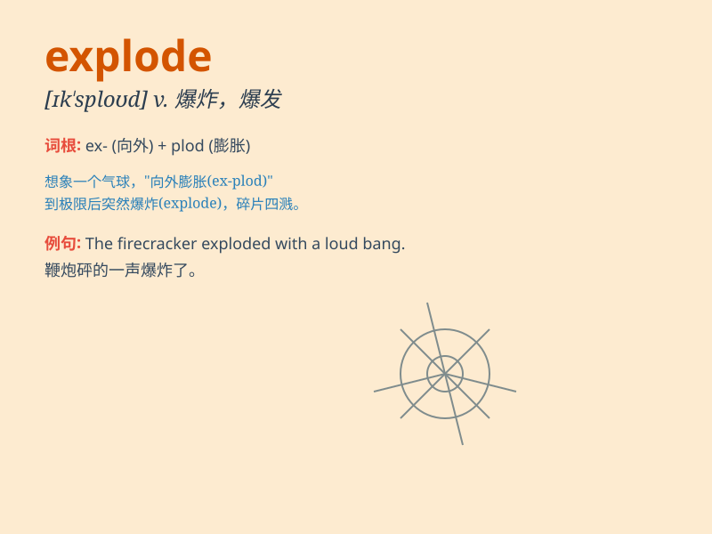

## explode

**英音:** _[ɪk\'spləʊd; ek-]_ **美音:** _[ɪk\'splod]_

**译义:** *vt.使爆炸vi.爆炸,爆发,破除,推翻,激发*

### 短语

+ **explode with anger:** _勃然大怒_

+ **explode into laughter:** _突然大笑起来_

+ **explode a bomb:** _引爆炸弹_

+ **explode a myth:** _打破神话_

+ **explode a theory:** _推翻理论_

### 例句

#### 例句1

> **The bomb exploded in the middle of the city.**

**中文翻译:** 炸弹在城市中心爆炸。

**单词释义:** （使）爆炸

#### 例句2

> **He exploded with anger when he heard the news.**

**中文翻译:** 当他听到这个消息时，他怒火中烧。

**单词释义:** 突然爆发（感情）

#### 例句3

> **The population of the city has exploded in recent years.**

**中文翻译:** 近年来，该市人口呈爆炸式增长。

**单词释义:** 急剧增加

### 背诵小故事

> A crazy scientist was working in his lab. He mixed some strange
chemicals and suddenly, everything explode. The room was filled with
smoke and debris. Poor scientist!

**一位疯狂的科学家在他的实验室工作。他混合了一些奇怪的化学物质，突然，一切都爆炸了。房间里充满了烟雾和碎片。可怜的科学家！**

### 图义

