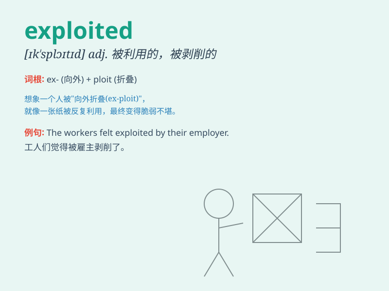

## exploited

**英音:** _[ɪkˈsplɔɪtɪd]_ **美音:** _[ɪkˈsplɔɪtɪd]_

**译义:** *adj.被剥削的；被利用的；被开发的*

### 短语

+ **exploited workers:** _被剥削的工人_

+ **exploited resources:** _被开发的资源_

+ **exploited territory:** _被开发的领土_

+ **exploited potential:** _被开发的潜力_

+ **exploited market:** _被开发的市场_

### 例句

#### 例句1

> **The company exploited its workers by making them work long hours
with low pay.**

**中文翻译:** 这家公司剥削工人，让他们长时间工作却支付低薪。

**单词释义:** 剥削

#### 例句2

> **Scientists are trying to exploit the potential of this new
technology.**

**中文翻译:** 科学家们正试图开发这项新技术的潜力。

**单词释义:** 开发；利用

#### 例句3

> **The film exploited the theme of love and betrayal to great
effect.**

**中文翻译:** 这部电影有效地利用了爱与背叛的主题。

**单词释义:** 利用

### 背诵小故事

> A poor miner was exploited by a greedy boss. The boss made him work
long hours in dangerous conditions but paid him very little. The
miner\'s hard work was exploited for the boss\'s profit.

**一位贫穷的矿工被一个贪婪的老板剥削。老板让他在危险的条件下长时间工作，却给他很少的报酬。矿工的辛勤劳动被老板用来谋取利润。**

### 图义

