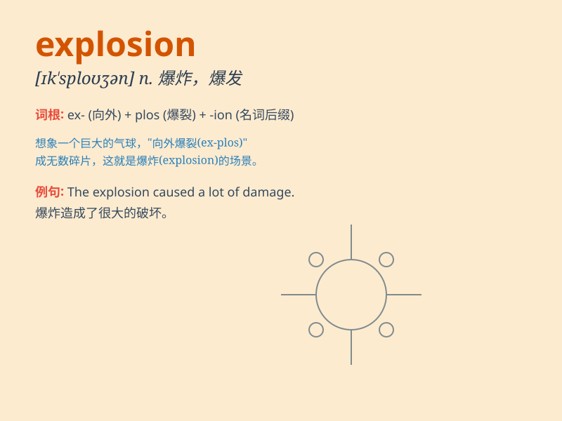

## explosion

**英音:** _[ɪk\'spləʊʒ(ə)n; ek-]_ **美音:**
_[ɪk\'sploʒən]_

**译义:** *n.爆发,发出,爆炸,[矿]煤气爆炸*

### 短语

+ **gas explosion:** _瓦斯爆炸_

+ **population explosion:** _人口爆炸_

+ **explosion proof:** _防爆的_

+ **nuclear explosion:** _核爆炸_

+ **dust explosion:** _粉尘爆炸_

### 例句

#### 例句1

> **The explosion was heard several miles away.**

**中文翻译:** 几英里外都能听到爆炸声。

**单词释义:** 爆炸

#### 例句2

> **The population explosion has caused many problems.**

**中文翻译:** 人口爆炸造成了许多问题。

**单词释义:** 激增

#### 例句3

> **There was an explosion of anger from the crowd.**

**中文翻译:** 人群中爆发出一阵愤怒。

**单词释义:** 爆发

### 背诵小故事

> One day, a scientist was conducting an experiment in the lab.
Suddenly, there was a loud noise and a bright flash. It was an
explosion! The force was so strong that everything was thrown into the
air.

**有一天，一位科学家正在实验室里做实验。突然，传来一声巨响和一道亮光。这是一场爆炸！力量非常强大，一切都被抛到了空中。**

### 图义

